# MoE 概述：从条件计算到 Qwen3-MoE
> 作者：杜子源源 \
> 如需完整文档和项目代码，请加入 QQ 群聊联系群主：1102504490。

这篇文档我将系统性的讲解Mixture of Experts (MoE)结构的理论起源与技术演进。文章中所有的数值与图示均引用自原论文.

全文按照时间线组织，各节对应关系如下：

- [1] 稠密 MLP：参数量和计算量耦合
- [2] 早期思想：条件计算
- [3] 从软混合到稀疏门控
- [4] 与Transformer FFN的结合
- [5] Switch Transformer：top-1 路由
- [6] Mixtral：开源可用的 top-2 方案
- [7] DeepSeekMoE：细粒度专家与共享专家
- [8] Qwen系列 MoE 架构演进
- [9] Qwen3-MoE
- [10] 核心公式与推理时的三步计算
- [11] 与本仓库代码的对应关系

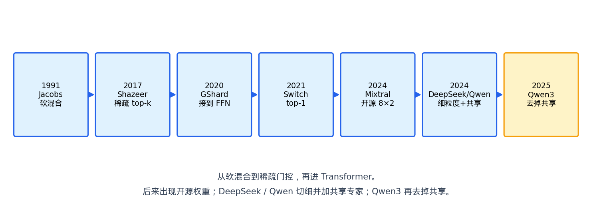

上图给出了上述各阶段的主要改动及其先后关系。

## 1. 稠密 MLP 的局限性

### 1.1. 结构回顾

Transformer 每一层由 Attention 子层与 MLP 子层构成。Attention 负责序列内各位置之间的信息交互；MLP 则对每个位置独立施加一次非线性变换。以 Qwen3 为代表的当代模型，其 MLP 采用 SwiGLU 结构：先经两路线性投影分别得到 gate 与 up 向量，对 gate 施加 SiLU 激活后与 up 逐元素相乘，最后经 down 投影映射回隐藏维度。

张量形状如下。

- 输入 $[N_{token}, d_{hidden}]$
- gate/up 投影将维度扩展到 $d_{intermediate}$
- down 投影再将其压缩回 $d_{hidden}$

其中全部的 token 都是共享同一组权重。

### 1.2. 参数量与计算量耦合
由上述结构可知：中间维度每扩大一倍，权重矩阵的存储量与单次前向的浮点运算量（FLOPs）均同步翻倍。换言之，在稠密架构下，模型容量与推理代价是线性绑定的。

扩大模型容量最直接的途径是增大 MLP。Kaplan 等人（2020）所总结的 scaling law 也印证了这一方向：在数据量充足的条件下，参数量越大，训练损失越低。然而参数增加意味着每次前向传播必须完成更多的矩阵乘法，训练时长与推理延迟随之上升。

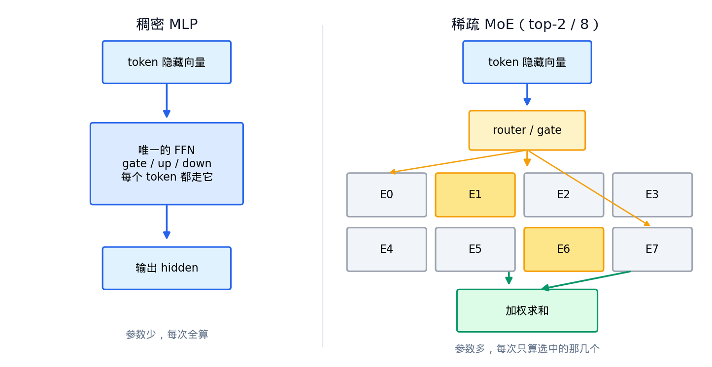

图 1 左侧为稠密 MLP。每个 token 进入唯一的 FFN，输出同形状的隐藏向量。右侧将同一层替换为一组专家网络。每个专家内部仍为独立的 SwiGLU 结构，但由一个路由器（router）先对当前 token 打分，仅选取其中两个专家参与计算。由此，总参数量可以大幅增加，而单次前向所涉及的矩阵乘法规模仍大致相当于两个 FFN 的量级。

## 2. 早期思想：条件计算
### 2.1. Mixture of Experts 的提出
条件计算的思想远早于 Transformer。Jacobs、Jordan 等人于 1991 年及 1994 年先后提出 Mixture of Experts 框架，彼时面向的是分类与回归等任务。其基本思路为：将一个复杂问题分解为若干较简单的子问题，每个子问题由一个专家网络负责，再由一个门控网络决定当前输入应交由哪些专家处理。

### 2.2. 核心动机

若单纯加宽网络，则每个输入都必须经过更宽的矩阵乘法，计算代价与参数量同步增长。条件计算（conditional computation）提供了另一条路径。

依据输入样本选择性地激活部分参数，此样本仅使用其中若干模块，彼样本使用另外若干模块。

如此一来，模型总容量可以很大，但是单次前向的计算量不必同等增大。

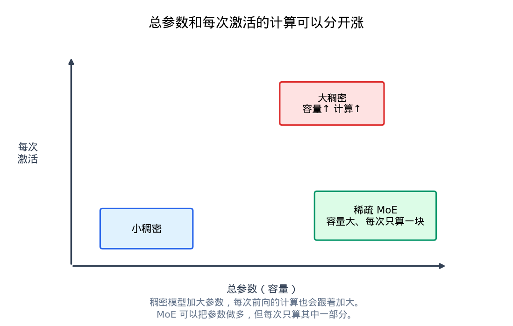

> 图 2 直观展示了这一区别。稠密模型增大参数时，每次前向的计算量随之线性增长；稀疏 MoE 则允许总参数持续增加，而每次仅计算其中一小部分。Shazeer 等人（2017）在论文开篇亦阐述了类似观点：网络吸收信息的能力受限于参数总量；若能按样本仅激活网络的一部分，便有可能在计算量增幅有限的前提下显著扩大模型容量。

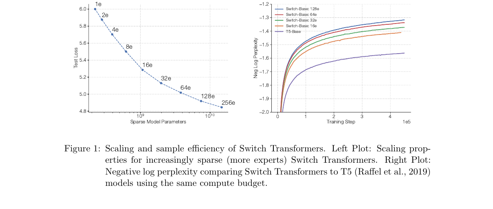

> 第 5 节将详细介绍 Switch Transformer 本身。此处先引用其 Figure 1 说明上述原理的量化表现。图 3 包含两组实验。左图在固定每 token FLOPs 的条件下，将专家数从 1 逐步增加至 256，稀疏参数从约$10^9$涨到$10^{10}$量级，测试损失持续下降。右图则固定计算预算，与 T5-Base 对齐：在相同计算量下，专家数越多，负对数困惑度下降越快，即样本效率越高。

简单来说专家可以带来两个优势：

1. 专家数增加带来总参数与模型质量的提升，而每 token 的 FLOPs 几乎不变
2. 在 FLOPs 对齐的稠密基线面前，稀疏模型以更少的训练步数即可达到相近的困惑度

但是 条件计算的初始框架无法实现上述效果。原因在于当时的门控是"软"的。这意味着所有专家均需要被加权求和，每个专家都必须完成前向计算。实际上，容量与计算仍然绑定。

要使总参数与单次计算脱钩，必须引入一个关键改动——**稀疏门控**，即对每个输入仅选取少数专家参与计算。

## 3. 从软混合到稀疏门控
### 3.1. 软混合的计算瓶颈。

前边我们提到，原始 MoE 框架采用"软混合"（soft mixture）机制。
门控网络对每个专家输出一个严格大于零的权重，所有专家均须对当前输入完成前向计算，最终输出为各专家输出的加权和。

由于所有权重均非零，梯度可以完整地回传至每一个专家，训练过程在数学上是完备的。

然而，这一机制带来一个根本性的限制：计算量与专家数成正比。
若将专家数从 4 个扩展至 400 个，则每次前向传播中需要执行的专家计算也相应增加 100 倍。换言之，软混合并未真正实现**总参数增大而单次计算不变**的目标。

那么，能否在保留多专家容量优势的同时，让每次前向仅计算其中一小部分？这正是稀疏门控所要回答的问题。

### 3.2. 稀疏门控的引入

Shazeer、Mirhoseini 等人 2017 年的 *Outrageously Large Neural Networks: The Sparsely-Gated Mixture-of-Experts Layer* 给出了关键改动。

在门控网络的 softmax 输出之后，仅保留数值最大的前 k 个分量，其余位置的门控值置为0。被置零的专家在当前前向传播中不参与计算，其输出被直接跳过。

论文展示了这一层的嵌入方式。将其置于两层 LSTM 之间，每个时间步调用一次 MoE 层，每次选中两个专家，各专家的输出乘以对应的门控值后求和，作为该层的最终输出。

可以注意到，与软混合相比，核心区别在于**未被选中的专家是否需要执行计算**。

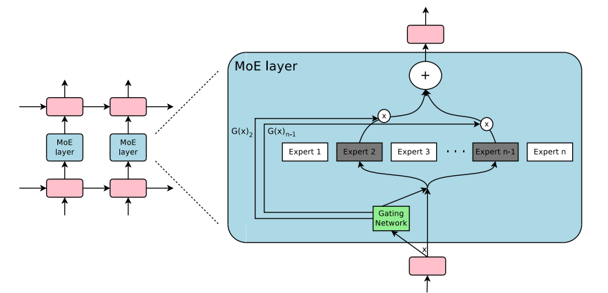

下图将两种机制并排呈现。

- 左侧为软混合。6 个专家全部参与计算，专家数增加则计算量线性增加。
- 右侧为稀疏门控：门控仅选中 2 个专家，其余 4 个被跳过。

此时，即使将专家数从 6 个扩展至 600 个，每次前向仍然只执行两次专家计算，外加一次门控评分。由于门控本身仅是一个小型线性层，其计算量相对于专家网络可以忽略不计。

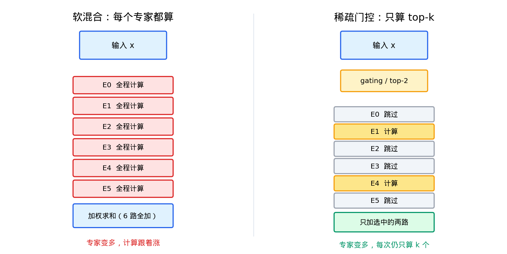

至此，我们已经了解到如何在增加参数量的前提在保证计算量不变。
但是一个新的问题自然出现：**稀疏门控是否真的能在不显著增加计算的前提下提升模型质量？**

### 3.3. 实验验证

Shazeer 等人在 1-Billion-Word 语言建模基准上进行了系统对照实验。实验将每步计算量控制在约 8 million ops，仅改变专家个数。具体设置如下：

- 平坦MoE：分别使用4、32、256个专家
- 分层MoE：分别使用256、1024、4096个专家

两种结构中，每次前向均只激活 4 个专家。
实验结果表明：当专家数仅为 4 时，由于这些专家几乎总是被选中，模型行为退化为近似稠密网络，其性能与计算量相当的 LSTM 基线基本持平。而当专家数增至 4096 时，测试困惑度在基线基础上进一步降低了 24%。论文摘要对此总结为：模型容量提升超过 1000 倍，而计算效率仅有少量下降。

这一结果验证了稀疏门控的核心价值：**在计算预算几乎不变的条件下，通过增加专家数获得显著的容量增益。**

### 3.4. 稀疏门控引入的难题

然而，稀疏门控并非没有代价。他主要会带来训练层面的问题，此后的各类 MoE 工作均需反复应对。

**问题一：负载不均衡。**
门控网络在训练初期即倾向于将输入集中分配给少数率先收敛的专家。这些专家因获得更多梯度而持续改善，其余专家则因长期缺乏训练信号而停滞，最终整层退化为一个规模较小的稠密网络。

为缓解这一现象，Shazeer 等人引入了两个辅助损失：

- importance 损失：约束一个 batch 内各个专家所获得门控权重之和，使其不会导致过度悬殊。
- load 损失：约束各个专家实际接收到的样本数量，防止个别专家被完全冷落。

这两个损失共同作用，促使负载在专家之间趋于均匀。

**问题二：每个专家分到的有效 batch 缩小。**$n$个专家里每次只选$k$个，原本大小为$b$的 batch，落到每个专家身上大约只剩$kb/n$ 。
当n远大于k时，每个专家的矩阵会变得非常**瘦长**。这会直接导致GPU并行度下降。

对此，Shazeer 等人采用的策略是：在 MoE 层将多个数据并行副本的 batch 合并为一个大 batch，各专家仍驻留在各自的设备上，输入与输出通过网络通信进行搬运。这一做法已具备专家并行（expert parallelism）的雏形。关于当代推理引擎如何处理此类通信，后续的章节会进一步讲解。

### 3.5. 稀疏 MoE 的一般形式

在稀疏门控确立之后，一层 MoE 可以统一表示为

$$
y = \sum_{i=1}^{n} G(x)_i \, E_i(x)
$$

其中 $E_i$ 是第 $i$ 个专家， $G$ 是门控， $x$ 是输入。 $G(x)$ 是稀疏向量。 $G(x)_i = 0$ 的专家不参与计算。

理解了这个一般形式之后，后续各节的变体便可以归结为对以下几个维度的不同选择：

- 门控 $G$ 如何计算（打分函数、归一化方式、稀疏化策略等）
- 专家总数和每次激活数的取值；
- 专家网络自身的结构；
- 是否额外设置若干个**共享专家**，使得每个 token 无论路由结果如何都会经过它们。

了解了稀疏 MoE 的核心思路，那么后续就会更加清晰化。

## 4. MoE 与 Transformer 的结合

### 4.1. 为什么选择 FFN 作为替换

2017 年的工作将稀疏门控层嵌入 LSTM 结构之中。2020 年，GShard（Lepikhin et al.）将这一思想迁移至机器翻译任务的 Transformer 架构，替换的对象是 FFN 子层。此后的开源大语言模型几乎全部沿用了这一位置选择。

为什么是 FFN，而非 Attention？要回答这个问题，需要比较两个子层的计算特性：

- **Attention 子层**包含 Q、K、V 投影及输出投影，所有位置共享同一组权重，且其核心操作注意力计算要求在序列维度上进行跨位置交互。若将 Attention 改为多专家结构，则路由决策与跨位置通信将相互耦合，复杂度显著上升。
- **FFN 子层**对每个位置独立施加相同的变换，天然适合按 token 进行路由。同时，在标准 Transformer 中，FFN 占据了每层参数量的主要部分（通常为 Attention 部分的 2 至 3 倍），是扩大模型容量的主要瓶颈所在。

因此，将 FFN 替换为稀疏专家层，既在实现上最为自然，又能在参数效率上获得最大收益。

### 4.2. GShard 的具体设计

GShard 采用 top-2 路由，即每个 token 选取门控得分最高的两个专家。在层的排布上，通常每隔一层进行一次 MoE 替换，而非每层都替换。这样做的好处在于：MoE 层引入的专家间通信（all-to-all）与非 MoE 层的纯本地计算可以交替进行，有助于在分布式训练中错开通信与计算的时间窗口，减少等待。

在规模上，GShard 将多语言翻译模型扩展至超过 6000 亿参数，训练在 2048 块 TPU v3 上完成。这是稀疏 MoE 首次在超大规模模型训练中得到验证。

下图引自 Hugging Face 的 MoE 综述文章，展示了从稠密 Encoder 到分布式 MoE Encoder 的结构演变。
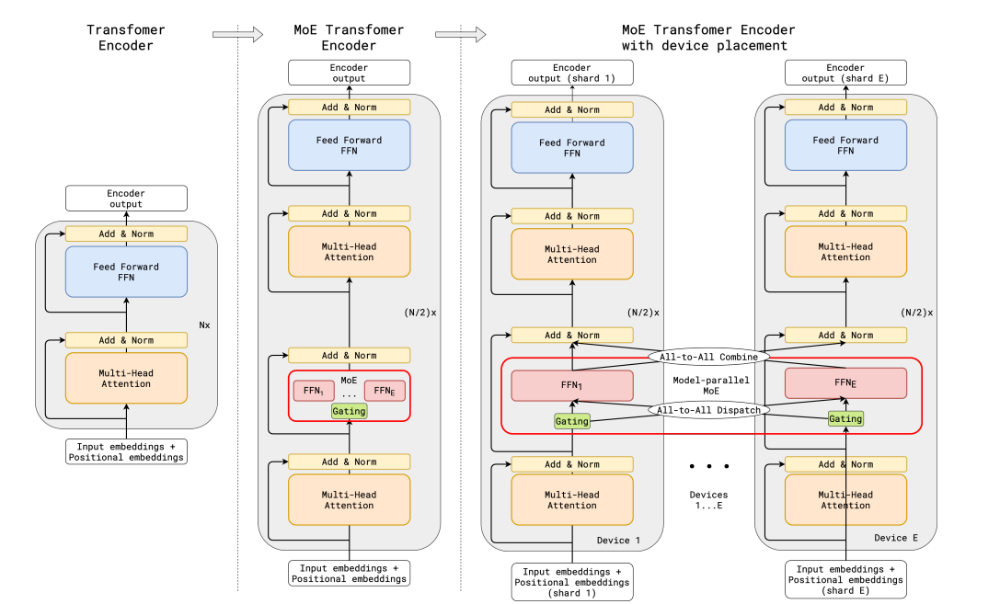

图 6 从左至右分为三个阶段：
1. 左图为标准 Encoder，FFN 为单一网络；
2. 中间将 FFN 替换为 Gating 网络加 E个并行专家；
3. 右侧将各个专家分布到不同的设备上，输入 token 通过all-to-all通信被发送至目标专家所在的设备，计算完成后再通过all-to-all返回原来的设备。

右侧所示的 token 迁移是专家并行的经典实现方式。需要指出的是，本项目（v5）并未采用 all-to-all 通信，具体的并行策略将在后续章节中详述。

### 4.3. 专家分工的涌现

一个值得关注的现象是：经过充分训练后，不同专家会自发地形成某种程度的功能分化。Switch Transformer 论文中曾给出一张分析表，列出各专家接收到的典型 token 类型。

观察发现：某些专家主要处理标点符号，某些主要处理冠词与连词，某些偏向动词，另一些则集中处理数字。这种分工并非人为设计，而是门控网络与专家网络在联合训练过程中自发涌现的结果。

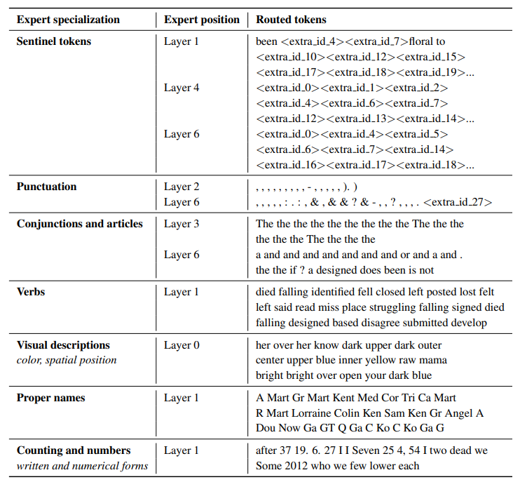

上边的表格展示了此类分工的典型模式。
当然，这种分化并非固定的。更换训练数据或随机种子后，各专家的具体职责会发生变化。但其存在本身说明，条件计算的意义不仅在于减少每次前向的矩阵乘法次数，还在于模型会将容量分配到不同的功能子空间中，即每个专家逐渐**专精**于处理某类输入模式。

当然，这一观察也引出一个后续将反复出现的问题：既然专家会自然分化，那么是否应当显式地保留一部分"**通用**"专家来处理所有 token 都会遇到的共性模式？

## 5. Switch Transformer
### 5.1. 为什么从 top-2 改成 top-1？

GShard 采用 top-2 路由，意味着每个 token 需要计算两个专家的输出，并在专家并行场景下将结果从两个设备回传。Switch Transformer（Fedus, Zoph & Shazeer, 2021）提出了一个看似激进的简化：将 k 从 2 降为 1。

为什么要这么改动呢？论文中提到，这一出发点主要从两个方面来理解：

- 计算层面。每个token仅需通过一个专家网络，前向计算量减半；
- 通信层面。在专家并行的部署中，每个 token 仅需与一个设备交换数据，通信开销大幅降低。

将路由从 top-2 压缩到 top-1，是否会损害模型质量？论文的实验表明：在其测试设置下，top-1 的质量与 top-2 MoE 基本持平，而速度优势明显。这一结论为后续更大规模的稀疏训练铺平了道路。

下图是论文原图，展示了 Switch Transformer 的 encoder block 结构。

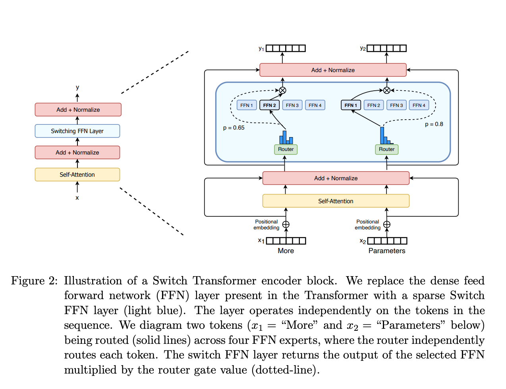

左侧仍为标准的 Self-Attention → FFN 流程；右侧将 FFN 替换为 Switch FFN：两个 token（图中标注为 "More" 与 "Parameters"）分别被路由至不同的专家网络，输出乘以对应的门控概率 p 后返回主路径。

### 5.2. 和 top-2 MoE 的定量对比

为使比较具有说服力，论文 Table 1 在统一条件下对比了三类模型：稠密 T5-Base、top-2 的 MoE-Base、以及 top-1 的 Switch-Base。实验设置为 32 核 TPU v3，128 个专家，每隔一层放置 MoE。评价指标为负对数困惑度（negative log-perplexity，数值越高表示模型越好）以及到达质量阈值 −1.50 所需的墙钟时间。

| 模型 | capacity factor | 100k step 质量 | 到达阈值的小时 | 例/秒 |
| --- | ---: | ---: | ---: | ---: |
| T5-Base | — | -1.731 | 未到达 | 1600 |
| MoE-Base | 2.0 | -1.547 | 68.7 | 840 |
| Switch-Base | 2.0 | -1.554 | 72.8 | 860 |
| MoE-Base | 1.25 | -1.559 | 80.7 | 790 |
| Switch-Base | 1.25 | -1.553 | 65.0 | 910 |
| MoE-Base | 1.0 | -1.572 | 80.1 | 860 |
| Switch-Base | 1.0 | -1.561 | 62.8 | 1000 |
| Switch-Base+ | 1.0 | -1.534 | 67.6 | 780 |

从表中可以读出以下几点：
1. 稠密基线在给定步数内未达阈值。 T5-Base 在 100k step 时的质量为 -1.731，尚未到达 −1.50，说明同等计算预算下稠密模型的样本效率明显低于稀疏模型。

- Switch 在低 capacity factor 下优势更显著。 当 capacity factor 从 2.0 降至 1.0 时，Switch-Base 的吞吐量从 860 例/秒提升至 1000 例/秒，到达阈值的时间从 72.8 小时缩短至 62.8 小时。capacity factor 越低，专家缓冲区越小，显存占用越少。这一约束在后续将模型推向千亿乃至万亿参数时尤为关键。
- Switch-Base+ 通过适度加宽进一步改善质量。 将隐藏维度从 768 增至 896，使计算量与 top-2 MoE 对齐，此时 100k step 质量达到 -1.534，优于所有其他配置。

综合来看，在相同墙钟时间与相同算力条件下，Switch 的速度和质量均优于稠密 T5，也优于当时的 top-2 MoE。

在样本效率方面，论文还报告了一组更直观的对比：Switch-Base 64 专家模型仅需约 60k step 即可达到 T5-Base 在 450k step 时的质量，按步数计加速约 7.5 倍，按墙钟计约 7 倍。

即便将稠密基线替换为更强的 T5-Large（其每 token FLOPs 为 T5-Base 的 3.5 倍），Switch-Base 仍保持约 2.5 倍的速度优势。

### 5.3. 容量因子与溢出处理
在训练阶段，每个专家能够接收的 token 数量是预先确定的。其计算公式为：
$$
\text{expert capacity} = \frac{\text{tokens per batch}}{\text{num experts}} \times \text{capacity factor}
$$

这里引入的 capacity factor（容量因子）是一个大于等于 1 的超参数，用于在理想均匀分配的基础上留出额外余量。当某个专家实际接收的 token 数超过其容量上限时，多余的 token 将被丢弃（overflow），该 token 在本层的 FFN 计算被跳过，其隐藏状态直接通过残差连接传递至下一层。反之，若某专家接收的 token 数不足容量上限，则空余位置以 padding 填充。

下图直观展示了 capacity factor 取 1.0 与 1.5 时的路由情况。

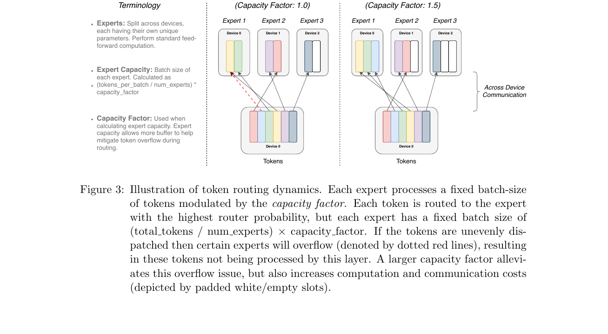

左图中，红色虚线标出了超出容量而被迫丢弃的 token；右图中，容量因子增大后槽位充裕，但白色空槽代表未被利用的计算与通信资源，构成一种浪费。因此，capacity factor 的选择实质上是在"**丢弃信息**"与"**浪费算力**"之间寻找平衡。

需要说明的是，容量因子机制主要服务于 TPU 等要求静态张量形状的加速器，同时也有助于训练过程的稳定性。本项目（v5）在 GPU 上执行推理，不采用按容量丢弃 token 的策略：某个专家被分配到多少 token 就计算多少，不足一个计算块的以 alignment padding 补齐。关于 alignment 在融合算子中的作用，将在下一章详述。

### 5.4. 从 Base 规模到 1.6 万亿参数

验证了 top-1 路由的有效性之后，Switch Transformer 进一步探索了超大规模训练。论文 Table 9 将稠密 T5 各尺寸与 Switch 变体的参数量及每序列 FLOPs 汇总如下：

| 模型 | 参数 | FLOPs/seq | $d_{model}$ |
| --- | ---: | ---: | ---: |
| T5-Base | 0.2B | 124B | 768 |
| T5-Large | 0.7B | 425B | 1024 |
| T5-XXL | 11B | 6.3T | 4096 |
| Switch-Base | 7B | 124B | 768 |
| Switch-Large | 26B | 425B | 1024 |
| Switch-XXL | 395B | 6.3T | 4096 |
| Switch-C | 1571B | 890B | 2080 |

对比表中数据，可以清晰地看到稀疏架构的核心特征：

- Switch-Base 的每序列 FLOPs 与 T5-Base 相同（均为 124B），但参数量从 0.2B 增至 7B，扩大了 35 倍。
- 最大规模的 Switch-C 拥有 1571B（约 1.6 万亿）参数与 2048 个专家，而每序列 FLOPs 仅为 890B，远低于参数更少的 T5-XXL 所对应的 6.3T。

这意味着通过增加专家数，稀疏模型的总容量可以增长数个数量级，而每个 token 的实际计算量保持基本不变。

在质量方面，Switch-C 相对于 T5-XXL，在相同计算预算下达到相近困惑度的速度约为后者的 4 倍，且训练步数越大差距越明显。然而，论文也如实报告了尚未完全解决的问题：

- Switch-XXL 的训练稳定性未得到彻底保障；
- 在 SQuAD 基准上，1.6T 参数的 Switch-C 得分 87.7，反而低于 FLOPs 更大但参数更少的 Switch-XXL 的 89.6。

该现象也说明稀疏参数的增加与下游微调效果之间的关系在当时尚未被完全理解。

换言之，预训练阶段庞大的稀疏参数量，并不一定能等比例地转化为下游任务的微调收益。
如何跨越预训练与微调之间的鸿沟，成为了下一阶段研究的焦点。

针对这一问题，同一研究团队在后续的 ST-MoE（Zoph et al., 2022）工作中给出了系统性的解答。他们的工作主要从两个维度展开：

首先是**巩固训练稳定性**。他们在原有的基础上引入了 **router z-loss** 等正则化技巧，进一步抑制了路由_logits_的过大波动，使大规模稀疏训练在更长的周期内保持数值稳定。

其次是**解决微调的超参敏感性**。ST-MoE 详细考察了稀疏模型在微调阶段的特殊行为。实验表明，由于每次前向传播仅激活部分参数，稀疏模型对微调时的学习率、batch size 等超参数表现出与稠密模型截然不同的敏感性。通过系统的超参适配，ST-MoE 首次使稀疏 MoE 在广泛的迁移任务中，取得了与同等计算预算下稠密模型相当的性能。这一成果标志着稀疏架构正式具备了实用化的微调能力。

然而，当稀疏 MoE 的微调流程被打通后，一个更深层次的问题随之浮现：**既然总参数量可以通过增加专家数轻易做大，那么这些参数应当如何组织，才能最大化其实际效用？**

单纯增加**专家数量（堆参数）**已不再是优化的终点。
因此以此为起点，后续如 DeepSeekMoE 等工作将研究重心从“**如何路由**”转向了“**专家如何切分**”与“**知识如何分配**”等更加底层的机制。

这些工作主要尝试解决如何设计更细粒度的专家结构？如何确保模型扩容带来的容量，真正转化为可迁移的“专长”，而非仅仅是数据分布的简单切分。

### 5.5. 训练稳定性的两项关键措施

在将模型推向大规模的过程中，训练稳定性是首要挑战。Switch 论文中有两项措施对此后的工程实践影响深远。

**第一项：选择性精度（selective precision）**。 论文发现，若将整个网络统一使用 bfloat16 训练，模型会发散。
Table 2 显示质量骤降至 -3.780。

而他们的解决办法是仅将路由相关的一小部分计算（softmax 及 top-1 选择）恢复为 float32，其余部分仍保持 bfloat16。

就是这一个小的调整就可以使质量回升至 -1.716，同时吞吐量维持在 1390 例/秒，几乎未受损失。
本项目 v5 中 route_experts 的 softmax 采用 fp32 计算，正是出于同一类数值稳定性考虑。

**第二项：缩小初始化尺度**。将参数初始化的标准差从 1.0 降低至 0.1，对 32 专家模型的早期训练产生了显著改善。

初始质量从 -3.60 提升至 -2.72，多次实验间的方差从 0.68 收敛至 0.01。这一措施有效抑制了训练初期的剧烈波动，为大规模稀疏训练的可复现性提供了保障。

## 6. Mixtral：开源可用的 top-2 方案
### 6.1. 结构概述

Mixtral 8×7B（Jiang et al., 2024）是首个在开源社区产生广泛影响的稀疏 MoE 大语言模型。其基本思路是：以 Mistral 7B 为骨干，将每一层的 FFN 替换为由 8 个专家构成的稀疏混合层，每个 token 经路由后选取其中 2 个专家参与计算。门控机制仍为 softmax 后取 top-k 的标准形式。下图为论文 Figure 1，展示了该层的结构。

### 6.2. 和 Switch 的差异

我们将Mixtral与前边的各个设计进行对比，可以归纳出下边的几点差异：

|维度|GShard|Switch(top-1)|Mixtral|
|---|---|---|---|
|激活专家|2|1|2|
|专家总数|数百至数千|64-2048|8|
|单个专家规模|小|小|大|
|MoE替换频率|隔一层|隔一层|每层FFN均替换|

可以看到，Mixtral 回到了 top-2 路由，但将专家总数压缩至 8 个，每个专家的中间维度相应增大。同时，Attention 子层、词嵌入矩阵、RoPE 位置编码等组件仍为全模型共享的一份参数。因此，模型总参数量约为 47B，而每次前向实际激活的参数量约为 13B。

论文 Table 1 给出的具体形状参数为：隐藏维度 4096，32 层，GQA 分组数 8（即 8 组 KV），上下文长度 32k，SwiGLU 中间维度 14336。

### 6.3. 开源的影响

Mixtral 之所以在开源社区引发广泛关注，不仅在于其架构本身，更在于其权重的发布方式：Apache-2.0 许可、32k 上下文、质量与当时的 Llama 2 70B 相当。

这一组合使得开源推理引擎首次有了将融合化 MoE 算子（fused MoE kernel）纳入常规工具链的直接动力。此后，vLLM、TGI 等主流推理框架相继加入对稀疏 MoE 的原生支持，Mixtral 在其中起到了关键的推动作用。

### 6.4. 评测结果
论文使用自有的评测管线，对 Mixtral、Mistral 7B 以及 Llama 2 系列进行了系统复测。下图为论文测试结果，黄色柱状条代表 Mixtral 8×7B。

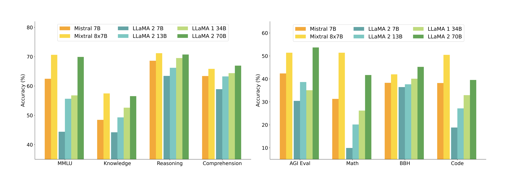

从分项结果来看：在 MMLU、知识问答与推理类任务上，Mixtral 与 Llama 2 70B 持平或略高；但在数学与代码生成方面，差距较为明显。

Table 3 汇总了几项常用基准的具体数值：

| | Llama 2 70B | GPT-3.5 | Mixtral 8×7B |
| --- | ---: | ---: | ---: |
| MMLU | 69.9% | 70.0% | 70.6% |
| HellaSwag (10-shot) | 87.1% | 85.5% | 86.7% |
| ARC Challenge (25-shot) | 85.1% | 85.2% | 85.8% |
| MBPP (pass@1) | 49.8% | 52.2% | 60.7% |
| GSM8K (5-shot) | 53.6% | 57.1% | 58.4% |
| MT Bench（Instruct） | 6.86 | 8.32 | 8.30 |

值得注意的是，Mixtral 在 MBPP 上显著超越了 Llama 2 70B 与 GPT-3.5，而在 GSM8K 上虽优于 Llama 2 70B，但与 GPT-3.5 仍有差距。这说明了稀疏架构在不同类型任务上的收益并不均匀。

### 6.5. 激活参数与总参数的区分

下图展示了激活参数与总参数的区别，横轴为激活参数量的对数尺度。

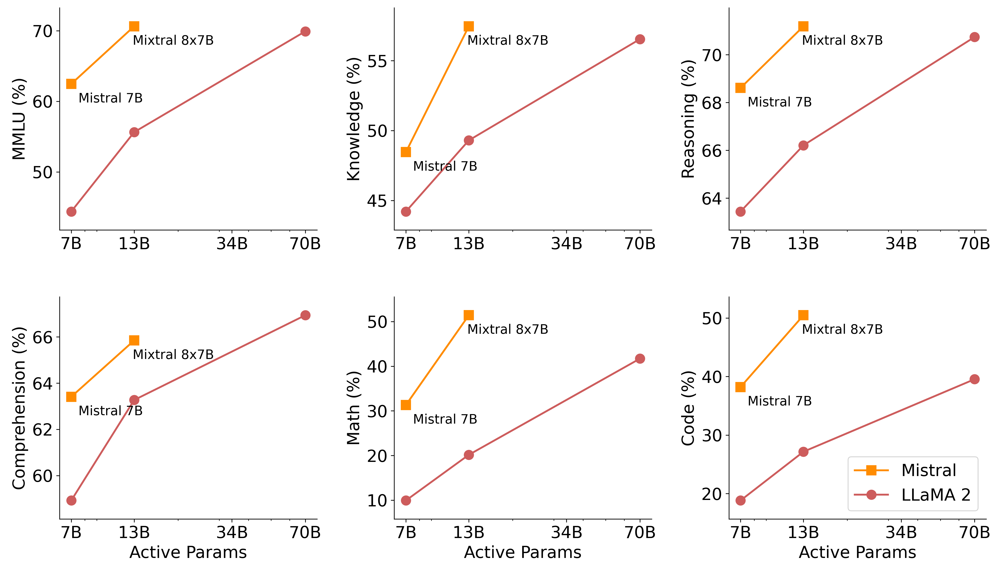

Mixtral 大约落在 13B 激活参数的位置，而纵轴质量已接近 Llama 2 70B。论文的表述为：激活参数约为后者的五分之一，但在大多数任务类别上仍优于该 70B 稠密模型。

然而，这里需要澄清一个常见的误解。上图的横轴是激活参数，而非总参数。在实际部署时，显存占用仍与 47B 的总稀疏参数成正比。只是该值小于 Llama 2 70B 的 70B 而已。此外，路由计算本身、以及单张设备上承载多个专家时的调度开销，都会引入额外代价。当 batch 足够大、算术强度足够高时，稀疏架构的 FLOPs 优势才能充分转化为吞吐优势。

简单来说，稀疏架构节省的是每次前向的**浮点运算量**，而非**权重存储**。

### 6.6. 专家路由的局限性

Mixtral 在 The Pile 验证集上统计了各层的专家分布情况。结果显示，除 DM Mathematics 等合成数据子集外，各领域之间的专家使用分布差异不大。图 13 为论文 Figure 8，将同一段代码、数学文本与英语文本按每个 token 的第一专家进行着色。

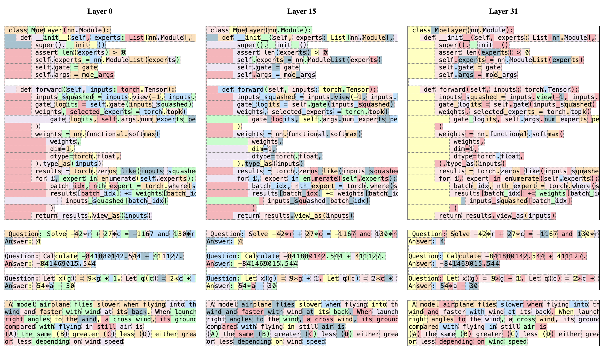

从图中我们可以看出来：

1. **浅层路由较为分散**。相邻的 token 频繁切换专家，而深层的路由趋于连续，通常会出现整段同色的区域。
2. **连续 token 落入同一专家的比例显著高于随机水平**，且该比例随层深增加而上升。

这一局部性特征对推理引擎的实现具有直接意义：在 decode 阶段，相邻 token 往往复用同一组专家，分组矩阵乘法就可以利用这种时间局部性来提升硬件利用率。

感兴趣的同学可以自行学习。

### 6.7. Insturct 版本
Mixtral 的 Instruct 版本采用 SFT（Supervised Fine-Tuning）加 DPO（Direct Preference Optimization）的两阶段对齐流程，在 MT-Bench 上取得 8.30 的得分。论文报告称，截至 2023 年 12 月，该模型是当时质量较好的开源对话模型之一。

总结 Mixtral 的设计选择。

- top-2 路由
- 少量较大规模的专家
- 全部 FFN 层均替换为 MoE。

这一配置在开源生态中得到了充分验证，也为后续工作提供了基线。

## 7. DeepSeekMoE：细粒度专家与共享专家

### 7.1. 问题提出

Mixtral 使用 8 个专家、每次选取 2 个，组合种类有 $\binom{8}{2} = 28$ 种。
可以看出组合空间还是偏小。

Deepseek团队就想到，**能否在总参数量与每次激活量均不变的前提下，能否通过改变专家的切分方式，使路由拥有更丰富的组合空间，从而让模型对不同输入做出更精细的响应？**

DeepSeekMoE（Dai et al., 2024）正是围绕这一问题展开的。其核心改动有两处，论文示意图从左至右依次展示了演变过程。

### 7.2. 细粒度分割

**第一处改动是细粒度专家分割。**
具体的做法为把一个较大的专家切成 $m$ 个较小的专家，中间维变成原来的 $1/m$ ，同时把 top- $k$ 乘上 $m$ 。

以Mixtral的配置为例，原始为8选2。若取 `m=4`。则专家总数变为32个，每次激活数变为8个，即32选8。此时路由组合数从 28 涨到 $ \binom{32}{8}=10,518,300$。
总参数量与每次激活量都没有改变，但是路由的选择空间扩大了数个数量级。

### 7.3. 共享专家
**第二处改动是共享专家。**
简单来说就是拿出$K_s$个专家当共享专家，这些专家不经过路由器，每个 token 均会经过；剩余专家仍由路由器分配。为了保持计算量，路由专家的 top-$k$再减掉$K_s$ 。

引入共享专家的动机在于：自然语言中存在大量所有上下文都会用到的公共知识（如基本语法、高频词汇的表示），这些知识适合由固定的共享专家承载；而路由器则可以将有限的激活配额专注于更具区分度的专业性内容。

有共享专家时，一层输出可以写成：

$$
y = \sum_{i=1}^{K_s} E_i^{\mathrm{shared}}(x)
  + \sum_{i \in \mathcal{T}} G(x)_i \, E_i^{\mathrm{routed}}(x)
$$

第一项对每个 token 均执行计算，不依赖路由结果；第二项仍为 top-k 稀疏计算。

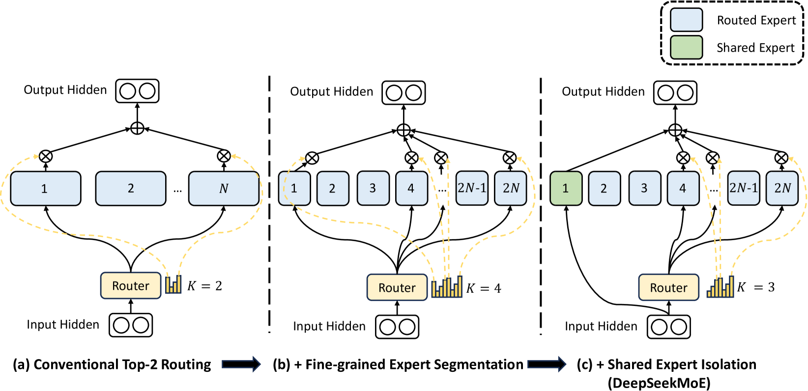

上图展示了从常规 top-2 到细粒度分割、再到隔离共享专家的三步演变。在整个过程中，专家总参数量与每次前向的计算量保持不变，变化的是专家的切分粒度以及哪些专家必定被激活。以 16B 配置为例：2 个共享专家加 64 个路由专家，每次激活 2 个共享专家与 6 个路由专家。

### 7.4. 消融实验

为验证上述两项改动的实际收益，论文在 Figure 3 中给出了系统的消融实验。纵轴为相对最优结果的归一化分数，横轴为不同任务类别。

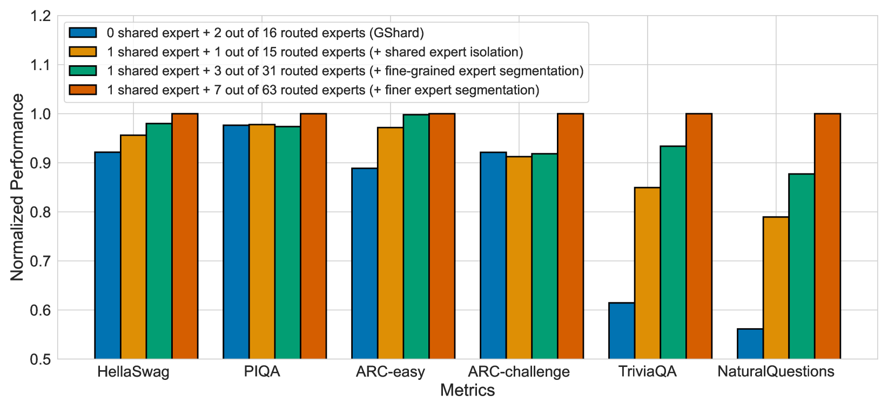

图中四组柱状条分别对应：

- 蓝柱：GShard 风格，0 个共享专家，16 个路由专家取 top-2；
- 黄柱：加入 1 个共享专家；
- 绿柱：在黄柱基础上进一步细粒度切分，1 个共享专家加 31 个路由专家取 top-3；
- 橙柱：更细粒度，1 个共享专家加 63 个路由专家取 top-7。

从结果来看：在知识类任务（如 TriviaQA、NaturalQuestions）上，蓝柱明显低于其余三组，说明缺少共享专家时，公共知识的表达受到了损害。随着共享专家的加入与专家粒度的细化，分数逐步提升，橙柱在多数任务上取得最优表现。

### 7.5. 专家冗余度的变化
除消融实验外，论文还设计了一组对照实验来考察专家间的冗余程度：在推理时人为关闭一部分本应被选中的路由专家，观察 Pile 验证集上的损失上升幅度。结果显示，DeepSeekMoE 的损失上升幅度大于参数量相当的 GShard 风格模型（GShard×1.5）。这表明，细粒度切分使得单个专家承载的知识更加专一，专家之间的冗余度降低，每个专家更难被其他专家替代。

### 7.6. 公开评测的表现

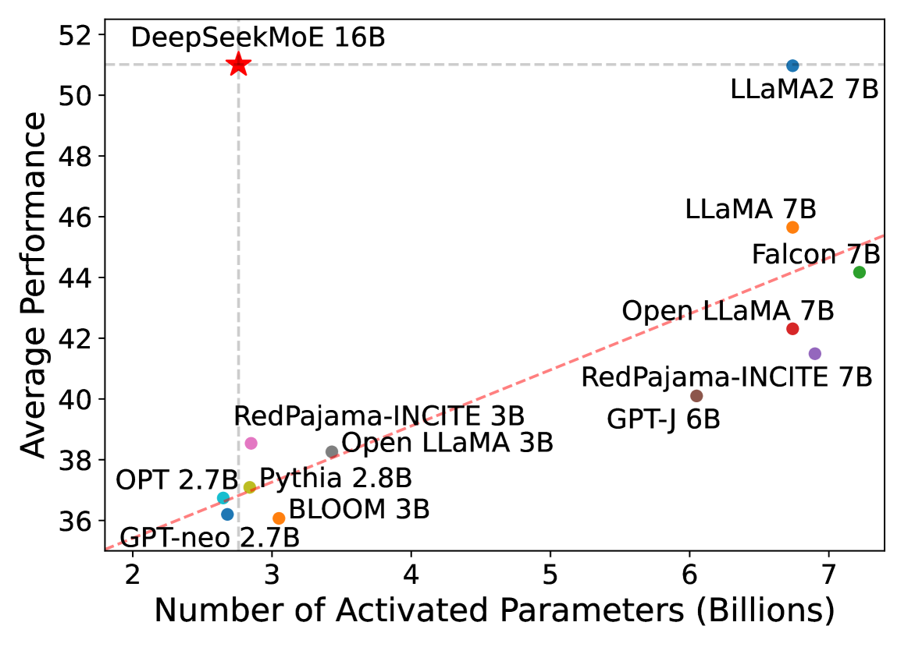

DeepSeekMoE 16B 以红星标示，大约位于 2.8B 激活参数、平均分约 51 的位置，与 Llama 2 7B 的质量接近，而激活量仅约为后者的 40%。图中红虚线为稠密模型自身的参数-质量趋势线，红星位于该线上方，说明在相同激活计算量下，稀疏架构的质量优于同规模稠密模型。

与自家稠密基线 DeepSeek 7B 相比，论文的结论为：以约 40% 的计算量，达到了相当的质量水平。

至此，开源 MoE 的设计空间中新增了两个重要维度：**细粒度专家切分与共享专家机制**。前者扩大了路由的组合空间，后者保障了公共知识的稳定表达。

然而，设计空间中的每一个选项都并非没有代价。共享专家是否在所有场景下都是必要的？细粒度切分是否会增加推理调度的复杂度？

之后我们将考察 Qwen 系列如何在继承这些设计的基础上做出取舍，以及 Qwen3-MoE 为何最终选择去掉共享专家。

## 8. Qwen 系列的 MoE演进
### 8.1. 概述

Qwen 系列的开源 MoE 模型始于 Qwen1.5-MoE，历经三代规格演进。在设计轴上，这三代均继承了 DeepSeekMoE 的两项核心机制：**细粒度专家分割与共享专家**。本项目（v5）在测试张量并行（TP）与专家并行（EP）时所使用的默认模型，即为该系列中的 Qwen1.5-MoE-A2.7B。

下面依次考察各代的具体配置及其演变逻辑。

### 8.2 Qwen1.5-MoE-A2.7B

Qwen1.5-MoE 的公开介绍材料通常将其描述为：
> 60 个路由专家加 4 个共享专家，每个 token 从路由专家中选取 4 个。

然而，查阅 HuggingFace 的 config.json 及对应代码可以发现，共享专家在实现上并非 4 个独立的小专家，而是一条单独的支路，其中间维度为路由专家的 4 倍：

| 字段 | 值 |
| --- | ---: |
| `num_experts` | 60 |
| `num_experts_per_tok` | 4 |
| `moe_intermediate_size` | 1408 |
| `shared_expert_intermediate_size` | 5632（= 4 × 1408） |

也就是说在参数量上，该共享支路等价于 4 个小专家的容量；但是在实现上，它是一个更宽的 SwiGLU 网络，输出再乘以一个 sigmoid 门控值。
模型总参数量约为 14B，每次前向激活约 2.7B。设计意图与 DeepSeekMoE 一致。

### 8.2 Qwen2-57B-A14B

Qwen2 技术报告将上述结构进一步放大。Table 1 中 57B-A14B 的规格如下：

| | Qwen2-57B-A14B |
| --- | ---: |
| hidden | 3584 |
| 层数 | 28 |
| 路由专家 | 64 |
| 每次选中（不含共享） | 8 |
| 共享专家 | 8 |
| 单个专家中间维 | 2560 |
| 总参数 / 激活 | 57B / 14B |

与 Qwen1.5-MoE 相比，主要变化有三处：
1. 路由专家从 60 个增至 64 个，每次激活数从 4 提升至 8；
2. 共享专家从"**一条宽支路（中间维为路由专家的 4 倍）**"改为 **8 个与路由专家同宽的独立共享专家**；
3. 细粒度特征仍然保留。单个专家中间维为 2560，远小于同系列稠密 7B 模型 FFN 的中间维 18944。

报告对此的解释是：在相近的总参数量与激活量下，从更大的专家库中选取 8 个专家，其路由组合数远多于粗粒度专家的少量组合，从而为模型提供更精细的容量分配。

### 8.3 Qwen2.5-MoE

Qwen2.5 技术报告（Yang et al., 2024）明确指出。

> MoE 结构仍沿用 Qwen1.5-MoE 确立的细粒度分割与共享专家路由方案。这一代开源权重以稠密模型为主，MoE 版本则以 API 形式对外提供。报告中的"Qwen2.5-MoE"指代这一代的 MoE 设计，与 Qwen1.5-MoE、Qwen2-MoE 同属细粒度加共享专家这一技术路线。

到这一步，Qwen 开源与产品 MoE 的共同点是：

1. 专家粒度细于Mixtral，top-k 往往大于 2。
2. 设计共享专家。
3. 层输出 = 共享支路 + 路由 top-k 加权和。

## 9. Qwen3-MoE
### 9.1. 核心改动
Qwen3 技术报告（Yang et al., 2025, arXiv:2505.09388）在延续细粒度分割的基础上，做出了两项关键改动：

- **取消共享专家**：不再设置每个 token 必经的固定支路；
- **扩大路由专家池**：路由专家总数增至 128 个，每次激活 8 个。

此外，训练阶段的负载均衡策略也相应更新：采用 global-batch load balancing loss（Qiu et al., 2025），在整个全局 batch 的范围内计算并约束各专家的负载，而非仅在单个微 batch 内均衡。其目的是在更大范围内推动专家之间的功能分化。

| 模型 | 层数 | Heads (Q / KV) | 专家（总 / 激活） | 上下文 |
| --- | ---: | --- | --- | --- |
| Qwen3-30B-A3B | 48 | 32 / 4 | 128 / 8 | 128K |
| Qwen3-235B-A22B | 94 | 64 / 4 | 128 / 8 | 128K |

30B-A3B 是总参数约 30B、激活约 3B；235B-A22B 是总参数 235B、激活 22B。名字里的 A3B / A22B 就是每次激活多少。

### 9.2. 与前代结构变化
将 Qwen3-MoE 与此前三代进行逐项对比，可以清晰地看到变化所在：

| | Qwen1.5-MoE / Qwen2-MoE / Qwen2.5-MoE | Qwen3-MoE |
| --- | --- | --- |
| 共享专家 | 有（必算） | 无 |
| 路由专家数 | 60 或 64 | 128 |
| 每次路由选中 | 4 或 8 | 8 |
| 负载均衡 | 常规 aux loss | global-batch load balancing |
| 一层输出 | 共享 + 路由加权和 | 只有路由加权和 |

### 9.3. 取消共享专家的动机

一个自然的问题是：既然共享专家在 DeepSeekMoE 及 Qwen 前代中均被证明有助于公共知识的表达，Qwen3 为何选择将其移除？

报告未提供单独针对"去掉共享专家"的消融实验表，但给出了如下解释：取消共享专家后，配合 global-batch 级别的负载均衡，路由机制能够更充分地推动各专家形成差异化分工；与此同时，激活参数可以被压缩至更低的水平。

报告给出的效果数据支持了这一设计选择：

- Qwen3-235B-A22B-Base 相对 DeepSeek-V3-Base：大约 1/3 的总参数、2/3 的激活参数，15 项里有 14 项更高。
- 相对自家 Qwen2.5-72B-Base：全部基准更高，激活参数不到 1/3。
- Qwen3-30B-A3B：激活的非嵌入参数大约只有 Qwen2.5-14B 的 1/5，各项更高，和 14B / 32B 稠密模型接近。
- 同系列对比：在相同的预训练数据下，Qwen3 MoE base 用大约 1/5 的激活参数就能接近同系列稠密 base；相对 Qwen2.5 MoE base，以不足一半的激活参数和更少的总参数即可实现超越。

### 9.4. 从 Mixtral 到 Qwen3

为便于整体把握，下表将从 Mixtral 到 Qwen3 的主要开源 MoE 模型规格汇总在一起。数值均以各论文及 `HuggingFace config.json` 为准。

| | Mixtral 8×7B | DeepSeekMoE 16B | Qwen1.5-MoE-A2.7B | Qwen2-57B-A14B | Qwen3-MoE |
| --- | --- | --- | --- | --- | --- |
| 路由专家 | 8 | 64 | 60 | 64 | 128 |
| 每次路由选中 | 2 | 6 | 4 | 8 | 8 |
| 共享专家 | 无 | 2 | 1 条（宽 4×） | 8 | 无 |
| 单个路由专家 | 较大 | 较小 | 较小 | 较小 | 较小 |
| 总参数 / 激活 | 47B / 13B | 16B / ~2.8B | ~14B / 2.7B | 57B / 14B | 30B / 3B 或 235B / 22B |
| 本仓库 | 结构兼容 | 结构同 Qwen2 这一路 | 默认测 TP/EP | 同 Qwen2-MoE 路径 | 兼容 |

### 9.5. 时间线

回顾从稀疏门控的提出到 Qwen3-MoE 的完整历程，各阶段的关键贡献可以概括如下：

- **Shazeer et al.（2017）**：确立稀疏门控机制，使未被选中的专家免于计算，总参数与单次计算得以解耦。
- **GShard（2020）**：将稀疏 MoE 层嵌入 Transformer 的 FFN 位置，并在超大规模多语翻译中验证。
- **Switch Transformer（2021）**：将路由简化为 top-1，训至万亿参数级别，系统研究了容量因子、训练稳定性等工程问题。
- **Mixtral（2024）**：以粗粒度专家、top-2 路由的配置发布开源权重，推动推理引擎对融合化 MoE 算子的支持。
- **DeepSeekMoE（2024）**：在相近激活量下引入细粒度分割与共享专家，扩展了设计空间。
- **Qwen1.5 / Qwen2 / Qwen2.5-MoE**：沿用细粒度加共享专家的路线，逐代放大规格。
- **Qwen3-MoE（2025）**：取消共享专家，将路由专家扩至 128 选 8，配合 global-batch 负载均衡推动专家分工，在更低激活参数下实现更高质量。

至此，MoE 结构从理论构想到开源落地的主要脉络已梳理完毕。下一节将给出推理时实际执行的三步计算流程，并建立与本仓库代码的对应关系。

## 10 核心公式与推理时的三步计算
### 10.1 从结构到计算

前九节梳理了 MoE 结构从提出到定型的演进过程。本节将视角从科普变成实战，梳理在MoE过程中有哪些核心计算。

### 10.2 门控计算

设当前 token 的隐藏状态为 $x \in \mathbb{R}^{d_{\text{hidden}}}$。门控网络的任务是为全部 $n$个专家各打一个分，再从中选出得分最高的$k$ 个。其数学形式为：

$$
G(x) = \mathrm{softmax}(W_g \, x), \quad
\mathcal{T} = \mathrm{TopK}\!\big(G(x),\; k\big)
$$

其中 $W_g \in \mathbb{R}^{n \times d_{\text{hidden}}}$ 为门控投影矩阵，$G(x) \in \mathbb{R}^n$ 为经 softmax 归一化后的门控概率向量，$\mathcal{T}$为被选中的$k$个专家的索引集合。

需要注意的是，门控计算对**每个 token** 都必须执行。原因在于：路由决策依赖于该 token 对全部专家的相似度评分，只有完成完整的打分与排序，才能确定哪些专家参与后续计算。门控本身是一个小型线性层，其计算量相对于专家网络可以忽略，但不可跳过。

### 10.3 层输出

确定被选中的专家集合$\mathcal{T}$ 后，该 MoE 层的输出为各被选中专家输出的加权和：

$$
y = \sum_{i \in \mathcal{T}} G(x)_i \, E_i(x)
$$

其中 $E_i$为第$i$ 个专家网络。在开源大语言模型中，$E_i$ 几乎无一例外地采用 SwiGLU 结构（即 gate-up-down 三投影加 SiLU 激活），与稠密模型中的 FFN 相同，只是每个专家拥有独立的一组权重。

### 10.4 各变体的差异

上述公式为最一般的形式。具体到不同模型，存在两处常见变体：

**变体一：top-$k$ 权重的二次归一化。** 部分实现在取出 top-$k$ 个门控值后，会对其再做一次归一化，使被选中专家的权重之和重新为 1。这一操作并非必需，但有助于稳定输出尺度。

**变体二：共享专家项。** 在 Qwen1.5 / Qwen2 等设有共享专家的模型中，层输出需额外叠加一项：

$$
y = E_{\mathrm{shared}}(x) \cdot \sigma(W_s x) + \sum_{i \in \mathcal{T}} G(x)_i \, E_i(x)
$$

其中 $E_{\mathrm{shared}}$ 为共享专家网络，$\sigma$ 为 sigmoid 函数，$W_s$为共享专家的门控投影。该项不经过路由器，对每个 token 均执行计算。Qwen3-MoE 已取消此项，层输出仅由路由专家的加权和构成。

### 10.5 推理时的三步计算流程

将上述公式映射到实际的推理执行流程，可以分解为三个依次进行的步骤：

**第一步：路由（Routing）。** 对当前 batch 中所有 token 的隐藏状态执行门控计算。具体操作为：调用门控线性层$W_g x$，在 fp32 精度下执行 softmax（以避免数值溢出），随后取 top-$k$，得到每个 token 对应的专家编号集合 $\mathcal{T}$及相应的路由权重$G(x)_i$。该步骤的计算量很小，但涉及排序操作，且其输出决定了后续步骤的数据分布。

**第二步：专家计算（Expert Computation）。** 对被选中的各专家执行前向计算。最朴素的实现是按专家逐个循环：对每个专家 $i$，收集所有路由到该专家的 token，执行一次完整的 SwiGLU 前向。这种写法在逻辑上是正确的，但在硬件利用率上并不理想。当专家数较多而每个专家分到的 token 数较少时，矩阵乘法的形状变得瘦长且不规则，GPU 的并行度下降。

实际推理引擎中常用的做法是：先按专家编号对所有 token 进行排序（或构建索引），将属于同一专家的 token 聚集在一起，再执行分组矩阵乘法（grouped GEMM）。这样，每个专家对应的矩阵乘法尽可能规整，硬件利用率得以提升。

**第三步：加权求和（Weighted Sum）。** 将第二步中各专家的输出，按对应的路由权重 $G(x)_i$加权，再对同一 token 的$k$路结果求和，写回形状为$[N_{\text{token}},\; d_{\text{hidden}}]$ 的输出张量。至此，该 MoE 层的前向计算完成。

需要指出的是，除上述三步外，Transformer 层内的其余组件（Attention 子层、RMSNorm、残差连接）与稠密模型完全相同。MoE 引入的额外计算成本主要集中在第二步：专家数量多、每个专家分到的 token 数不均匀，导致矩阵乘法的形状不规则，这是推理引擎优化的核心难点。

### 10.6 推理与训练的两处关键差异

在结束本节之前，有必要明确推理阶段与训练阶段在 MoE 处理上的两处重要差异。这两点在 Switch 的 Figure 3 与 Mixtral 的 Figure 3 中均有涉及。

**差异一：推理通常不丢弃 token。** 训练阶段引入的 capacity factor 机制（超出容量的 token 被丢弃，仅通过残差传递）主要是为了适配 TPU 等需要静态张量形状的加速器，同时也有助于训练稳定性。推理阶段则一般不执行丢弃操作：无论某个专家被分配到多少 token，均完整计算。若某专家分到的 token 数不足以凑满一个计算块，则以 alignment padding 补齐，而非丢弃。

**差异二：推理必须将全部专家权重载入显存。** 稀疏架构节省的是每次前向的浮点运算量，而非权重存储。以 Mixtral 为例：每次前向仅激活约 13B 参数，但全部 47B 的稀疏权重仍需常驻显存，因为下一个 token 可能路由到任意专家。这意味着，在显存规划上，稀疏模型的总参数量仍是决定性的约束条件。

## 11 与本仓库的对应关系
dzyy-vllm 的 v5 版本完整实现了 Qwen 系列 MoE 架构的核心计算流程，覆盖 Qwen1.5-MoE / Qwen2-MoE（细粒度 + 共享专家）与 Qwen3-MoE（细粒度、无共享专家）两条路线，并在本版中同步支持了专家并行（EP）。

### 11.1 支持的模型范围

本项目（v5）所支持的 MoE 模型覆盖 Qwen 系列的两条技术路线：

- **细粒度 + 共享专家路线**：Qwen1.5-MoE、Qwen2-MoE；
- **细粒度 + 无共享专家路线**：Qwen3-MoE。

v5 对 Qwen3-MoE 的架构进行了完整实现，涵盖路由、专家计算、加权求和的全部流程，并在该版本中同步实现了专家并行（Expert Parallelism, EP）。

### 11.2 多卡并行策略

在多卡部署时，MoE 层提供两种并行切分方式：

- **MoE 张量并行（MoE TP）**：将每个专家的中间维度沿列或行切分到多张卡上，每张卡持有所有专家的一部分参数。适用于专家数较少但单个专家较大的场景。
- **专家并行（EP）**：将专家整组分配到不同卡上，每张卡仅持有部分专家的完整权重。适用于专家数较多的场景（如 Qwen3 的 128 个专家）。

当模型包含共享专家时，多卡通信中需注意一个细节：AllReduce（AR）操作与共享专家支路的执行顺序必须正确安排。若顺序不当，共享专家的输出可能在多张卡上被重复累加。具体的处理方式及原因，详见后续文档 [02-专家并行](02-专家并行.md)。

