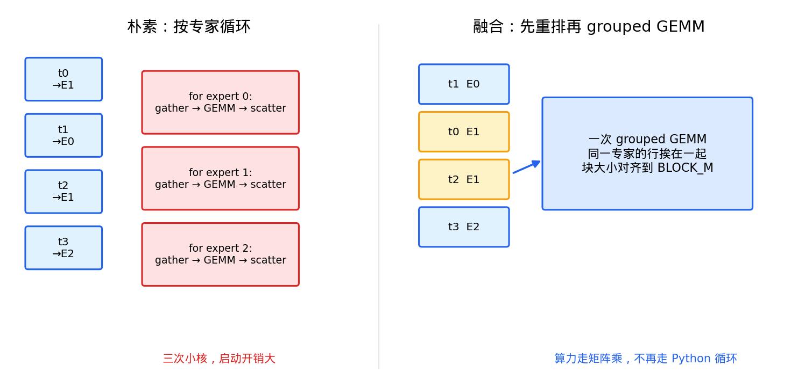
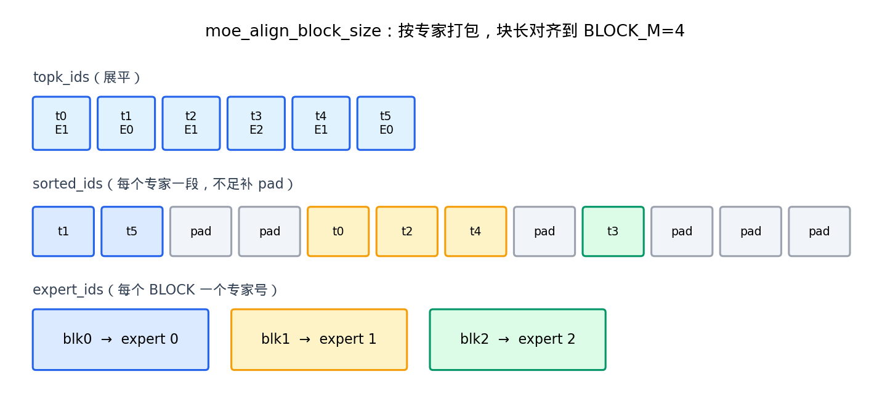
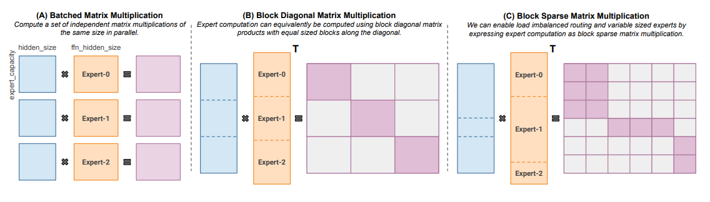
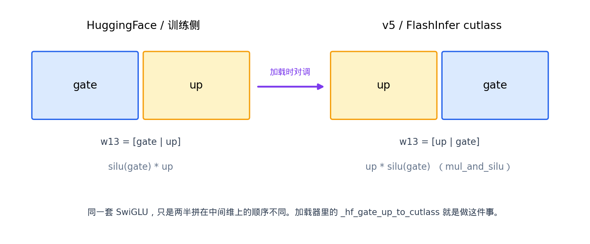
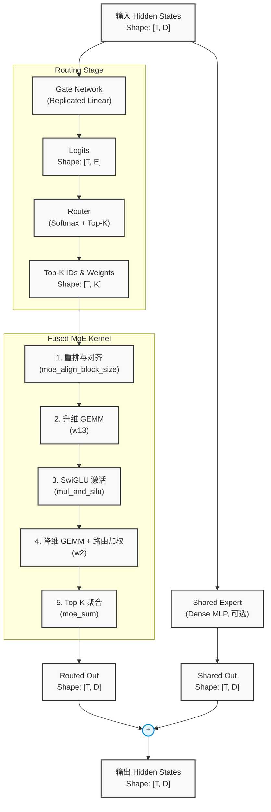

# MoE 路由与融合计算
> [!NOTE] 作者：杜子源源 
> 如需完整文档和项目代码，请在博客[https://dlog.com.cn](https://dlog.com.cn)中点击【关于-赞助】扫码。 \
> 扫码时务必备注 github 个人邮箱。

上一节我们了解到了MoE的发展脉络，但是 MoE 在推理时究竟是如何进行具体的张量运算的呢？
本节我们将深入模型内部，详细拆解 MoE 的前向计算过程。


## 1. MoE 在 Transformer 中的位置

之前我们提到过，在标准的 Transformer 中，每一层的核心由两部分组成：

- Attention 模块
- MLP/FFN 模块。

MoE 核心就是对 FFN 进行改造。
具体来说 MoE 将原本稠密的 MLP 替换为了 “**门控路由+专家MLP**”的方案。

因此理解 MoE 的前向计算，本质上就是理解这个 模块是如何处理数据的。

### 1.1. 符号约定

为了清晰的描述输入与输出的张量是如何变换的，我们在这里首先统一符号与维度定义。

假设输入到 MoE 层的隐藏状态的张量形状为 $[T, D]$，其中：

- T 表示当前的 Batch 中的 Token 总数
- D 表示模型的隐藏层维度，例如 4096
- E 表示路由专家的总数量，例如64、128等
- K 表示每个 token 实际激活，也就是真正路由到专家的数量，例如2或者8等。

### 1.2. 核心计算流

有了上述符号，我们便可以把 MoE 的核心计算拆解为以下几个逻辑阶段。

> [!NOTE] 门控打分 Gate
> 门控网络通常是一个非常简单的线性层，它的作用是评估每一个 token与各个专家之间的亲和力。输入为 $[T, D]$, 通过一个权重矩阵 $[D \times E]$进行线性映射，得到 logits，得到一个分数矩阵 $G \in \mathbf{R}^{[T \times E]}$ ，其中 $G_{i,j}$ 表示第 i 个 token 被分配给第 j 个专家的原始得分。

> [!NOTE] Top-K 选择 Route
> 得到原始的分数后，路由模块需要决定每个 token 具体交给哪几个专家处理，并且计算相应的权重。输入为 $[T \times E]$, 对 G 中每一行，也就是每个 token 的 E 个得分都进行 Softmax 归一化，得到概率分布。选取每个 Token 中最大的 K 个值，并对这 K 个值再次进行归一化，确保它们的和为 1。最终会得到专家索引 $I \in \mathbf{N}^{T \times K}$ 和路由权重 $W \in \mathbf{R}^{T \times K}$。


具体来说，对于第 $i$ 个 token，MoE 会取出它选中的 $K$ 个专家，并分别计算这些专家对该 token 的输出，最后按权重加权求和：

$$
Y_i = \sum_{k=1}^{K} W_{i,k} \cdot E_{I_{i,k}}(X_i)
$$

为了避免这个公式过于抽象，我们举一个小例子。假设当前 MoE 层一共有 4 个专家：

$$
E_0, E_1, E_2, E_3
$$

每个 token 只激活 2 个专家，即 $K=2$。我们把隐藏层维度简化为 $D=4$，并假设当前有两个 token，即 $T=2$。

这里假设路由模块给出的结果为：

$$
I =
\begin{bmatrix}
1 & 3 \\
0 & 2
\end{bmatrix}
$$

$$
W =
\begin{bmatrix}
0.7 & 0.3 \\
0.6 & 0.4
\end{bmatrix}
$$

这表示：

- 第 0 个 token 选中了专家 1 和专家 3，权重分别是 0.7 和 0.3；
- 第 1 个 token 选中了专家 0 和专家 2，权重分别是 0.6 和 0.4。

对于第 0 个 token，假设专家 1 和专家 3 分别给出如下输出：

$$
E_1(X_0) = [1.0,\ 0.0,\ 2.0,\ -1.0]
$$

$$
E_3(X_0) = [3.0,\ 2.0,\ 0.0,\ 1.0]
$$

那么 MoE 层会按路由权重进行加权求和：

$$
Y_0 =
0.7 \cdot [1.0,\ 0.0,\ 2.0,\ -1.0]
+
0.3 \cdot [3.0,\ 2.0,\ 0.0,\ 1.0]
$$

得到：

$$
Y_0 =
[1.6,\ 0.6,\ 1.4,\ -0.7]
$$

这就是第 0 个 token 经过路由专家之后的输出。

类似地，对于第 1 个 token，假设专家 0 和专家 2 的输出为：

$$
E_0(X_1) = [0.5,\ 1.0,\ -1.0,\ 0.0]
$$

$$
E_2(X_1) = [-1.0,\ 3.0,\ 1.0,\ 2.0]
$$

那么：

$$
Y_1 =
0.6 \cdot E_0(X_1) + 0.4 \cdot E_2(X_1)
$$

得到：

$$
Y_1 =
[-0.1,\ 1.8,\ -0.2,\ 0.8]
$$

因此，这一批两个 token 经过 Experts 计算后，得到的输出为：

$$
Y =
\begin{bmatrix}
1.6 & 0.6 & 1.4 & -0.7 \\
-0.1 & 1.8 & -0.2 & 0.8
\end{bmatrix}
$$

其形状仍然为 $[T, D] = [2, 4]$。

也就是说，MoE 层虽然内部会根据每个 token 的选择调用不同的专家，但对外仍然保持与普通 MLP 相同的输入输出形状：输入是 $[T, D]$，输出也是 $[T, D]$。

> [!NOTE] 共享专家计算 （可选）
> 路由专家擅长处理特定领域的特征，但可能会丢失全局的通用特征。为此，许多模型引入了共享专家，它是一个所有 token 都必须经过的稠密 MLP。 这里的计算就是经过一个 MLP 计算即可。

> [!NOTE] 多卡通信 all-reduce
> 在单机多卡或多机多卡的专家并行（Expert Parallelism, EP）场景下，专家被切分到了不同的 GPU 上。此时，单卡只能计算出分配给自己的那部分专家的结果。因此需要显卡间通信来将所有 GPU 上的局部结果跨卡求和，并最终得到完整的 MoE 层输出。


总结如下：

| 模块 | 输入 / 输出 | 做什么 |
| --- | --- | --- |
| gate | `[T, D] → [T, E]` | 线性打分，每个 token 对全部专家给一个分数 |
| route | `[T, E] → [T, K]` | softmax 后取 top-k，得到专家编号与权重 |
| experts | hidden + topk → `[T, D]` | 对被选中的专家做 SwiGLU，再按权重求和 |
| shared expert（可选） | `[T, D] → [T, D]` | 每个 token 都要算的一支 SwiGLU |
| all-reduce（多卡） | `[T, D]` | 把各卡局部结果加齐 |


通过上述拆解可以看出，MoE 层的前向计算虽然引入了动态路由和分布式通信，但其核心数据流的维度始终保持为 $[T,D]$ 。这种设计确保了 MoE 层可以像普通 FFN 一样，无缝即插即用地嵌入到现有的 Transformer 架构中。

## 2. 显存物理布局

### 2.1. 专家权重在显存的形状

在标准的稠密 Transformer 中，FFN 的权重通常是二维矩阵。
但是在 MoE 架构中，由于存在 E 个独立的专家，所有的权重矩阵都会增加一个维度，这里可以称之为专家维度，升维变成三维张量。

在单卡且未进行张量切分的场景下，核心权重的物理形状如下表所示：

| 符号 | 形状 | 含义 |
| --- | --- | --- |
| $x$ | `[T, D]` | 本层输入的 token 隐藏状态 |
| $W_g$ | `[E, D]` | 门控权重 |
| $W_{\mathrm{gate}}, W_{\mathrm{up}}$ | `[E, I, D]` | 专家第一层升维权重，$I$ 为中间层维度|
| $W_{\mathrm{down}}$ | `[E, D, I]` | 专家第二层降维权重 |
| $y$ | `[T, D]` | 本层输出 |

其中 $T$ 是 token 数，$D$ 是 hidden，$I$ 是专家中间维，$E$ 是专家数，$K$ 是 top-k。

这种三维布局表明，尽管我们每次前向传播计算量减少，但是显存占用量却并没有下降，简单来说就是 MoE 只节省算力，但是并不节省显存。

### 2.2. 算术强度

为了评估 MoE 层的计算效率，我们需要计算单个 Token 经过该层时的浮点运算次数（FLOPs）。

1. 门控网络 Gate：一次矩阵乘法，计算量约为 $2DE$.
2. 专家网络 Experts：每个被选中的专家需要执行三次矩阵乘法（Gate、up、Down），每次计算量约为 $2ID$，单个专家的总计算量为 $6ID$。

因此单个 Token 经过 MoE 层的总计算量（FLOPS）大约为：

```math
2DE + K \cdot 6ID
```

当 K 远小于 E 时，MoE 层的实际计算量远小于同等维度的稠密 MLP。然而，由于所有 E 个专家的权重都需要从显存中读取，MoE 层的算术强度往往低于稠密模型。这种“计算量小、访存需求大”的特性，直接导致了最朴素的 MoE 代码实现会遭遇严重的显存带宽瓶颈，并且关于 Top-K，关于并行也会产生额外的瓶颈，那么如何在实际写代码的过程中解决这个问题呢？

下边我们就会讲到如何进行算子融合，以及如何实现重排优化。


## 3. MoE 实现及优化
### 3.1. Naive 版本

在探讨实际生产的代码优化之前，我们先写一个最最基础的版本，直观感受一下 MoE 的代码。


```python
def naive_moe_forward(hidden, w_gate, w13, w2, topk):
    T, D = hidden.shape
    E, I_2, _ = w13.shape
    I = I_2 // 2
    out = hidden.new_zeros(T, D)
    
    # 1. 门控网络 (Gate)
    # 计算每个 token 对所有专家的原始得分
    # hidden: [T, D], w_gate: [E, D] -> logits: [T, E]
    logits = hidden @ w_gate.T 
    
    # 2. 路由策略 (Route)
    # 计算概率分布并提取 Top-K 专家
    probs = torch.softmax(logits, dim=-1, dtype=torch.float32)
    topk_weights, topk_ids = torch.topk(probs, topk, dim=-1)
    
    # 对选中的 K 个权重进行归一化，确保和为 1
    topk_weights = topk_weights / topk_weights.sum(dim=-1, keepdim=True)

    # 3. 专家计算与聚合 (Experts)
    for t in range(T):
        for k in range(topk):
            e = int(topk_ids[t, k])
            
            # 提取第 e 个专家的权重并执行 SwiGLU
            gu = hidden[t] @ w13[e].T          # 升维: [2I]
            gate, up = gu[:I], gu[I:]          # 拆分 gate 与 up
            h = up * torch.nn.functional.silu(gate) # 激活: [I]
            y = h @ w2[e].T                    # 降维: [D]
            
            # 按路由权重加权并累加到输出
            out[t] += topk_weights[t, k] * y   
            
    return out
```

该逻辑在数学上完全等价于 MoE 的定义。最外层循环遍历所有的 token，内层循环遍历选中的专家。每个专家独立执行一次完整的前馈网络计算，最后按路由权重进行线性组合。

但是若将上述逻辑直接映射到 GPU，最基础的线程分配策略是让一个 Warp 负责处理一个 token。路由模块输出专家编号与权重后，该 Warp 对每个选中的专家执行三次矩阵向量乘法。中间激活值存放在共享内存中。

这种实现保证了数值语义的正确性，但在实际推理中会导致严重的性能衰退。


同时我再给出一个 CUDA 的版本，方便大家在面试过程中快速手撕，完整的代码放在了我的开源仓库 [Awesome-AI-Infra-Learning](https://github.com/ZiyuanDu/Awesome_AI_Infra_Learning)中。
```cpp
// 示意：moeBasic，教学用；展示 Warp-per-Token 的基础执行流
template <int E, int TOPK>
__global__ void moeBasic(
    const float* x,          // 输入: [T, D]
    const float* W_router,   // 路由权重: [E, D] (原 Wg，重命名以消除歧义)
    const float* Wgate,      // 专家 Gate 权重: [E, I, D]
    const float* Wup,        // 专家 Up 权重: [E, I, D]
    const float* Wdown,      // 专家 Down 权重: [E, D, I]
    float* y,                // 输出: [T, D]
    int T, int D, int I) 
{
    // 线程映射: 假设 blockDim.x == 32 (一个 Warp), blockDim.y = 每个 Block 处理的 Token 数
    int tok = blockIdx.x * blockDim.y + threadIdx.y;
    int lane = threadIdx.x; // 0 ~ 31
    
    if (tok >= T) return;

    // 动态共享内存: 每个 Token 分配 D (输入) + I (中间激活) 的空间
    extern __shared__ float smem[];
    float* xs = smem + threadIdx.y * (D + I);
    float* h  = xs + D;

    // 1. 将当前 Token 的特征从全局内存加载到共享内存 (Coalesced Load)
    for (int d = lane; d < D; d += 32) {
        xs[d] = x[(size_t)tok * D + d];
    }
    __syncwarp(); // 确保同一 Warp 内的加载完成

    // 2. 路由计算: 计算 logits, softmax, 并获取 Top-K 的专家索引和权重
    int expert[TOPK];
    float w[TOPK];
    // 注意: 此处假设 warpSoftmaxTopk 内部已处理了 Warp 级别的同步与计算
    warpSoftmaxTopk<E, TOPK>(xs, W_router, D, expert, w);

    // 3. 初始化输出缓冲区为 0
    for (int d = lane; d < D; d += 32) {
        y[(size_t)tok * D + d] = 0.f;
    }
    __syncwarp();

    // 4. 专家计算与聚合 (Top-K 循环)
    #pragma unroll
    for (int k = 0; k < TOPK; k++) {
        int e = expert[k];
        if (e < 0) continue; // 防御性编程: 跳过无效路由 (如 padding)

        // 4.1 升维 (Gate & Up) + SwiGLU 激活
        // 每个线程负责计算中间维度 I 的一部分
        for (int i = lane; i < I; i += 32) {
            float g = 0.f, u = 0.f;
            // 权重布局假设为 [E, I, D]，即连续存储每个专家的 I 行，每行 D 个元素
            const float* wg = Wgate + ((size_t)e * I + i) * D;
            const float* wu = Wup   + ((size_t)e * I + i) * D;
            
            for (int d = 0; d < D; d++) {
                float xd = xs[d];
                g += xd * wg[d];
                u += xd * wu[d];
            }
            h[i] = silu(g) * u; // SwiGLU 激活
        }
        __syncwarp(); // 确保所有线程完成 h[i] 的写入，供下一步读取

        // 4.2 降维 (Down) + 路由权重加权累加
        // 每个线程负责输出维度 D 的一部分
        for (int d = lane; d < D; d += 32) {
            float a = 0.f;
            // 权重布局假设为 [E, D, I]
            const float* wd = Wdown + ((size_t)e * D + d) * I;
            
            for (int i = 0; i < I; i++) {
                a += h[i] * wd[i];
            }
            // 单线程顺序累加 Top-K 的结果，无需 atomicAdd，安全且高效
            y[(size_t)tok * D + d] += w[k] * a;
        }
        __syncwarp(); // 确保当前专家的贡献已写入，准备处理下一个 k
    }
}
```


### 3.2. Naive 的硬件瓶颈

上述算法为什么执行效率低下呢？其核心原因在于数据流和 GPU 的硬件特性不匹配。为什么这么说？

首先，在 Decode 阶段， 单个 Batch 的 token 通常很少。如果按照专家进行循环，每个专家都需要 Gather、GEMM、Scatter 操作。尽管计算本身时间很短，但是 Kernel 启动和调度开销会占据主导地位。

其次，路由过程是动态的。在一个 Batch 中，某个专家可能被分配了 40 个 token，而另一个专家只分配了 2 个 token。GPU 的 tensor core 依赖规整的大矩阵（如 128×128）进行高效计算。这种长短不一、形状不规则的小矩阵无法充分利用硬件的并行计算单元。对于权重读取是完全离散的，这会破坏空间局部性，导致 Cache 命中率低，最终造成带宽的浪费。

最后，在按 token 遍历的计算模式下，每个 token 独立读取专家权重。同一专家的权重矩阵会被多个 token 反复从 HBM 加载至缓存。MoE 层的算术强度极低，系统性能受限于 HBM 带宽，会形成明显的内存墙。

### 3.3. 从“token 找专家”到“专家找 token”

上述瓶颈的核心来源其实主要是由于计算过程中，每个token都会重复去找专家；但是如果改成先把路由到同一个专家的 token 聚合到一起，再统一计算，这样不仅提升了计算密度，也降低了访存次数。

在实践中，通常被叫做“专家重排”。重排之后的多段矩阵乘，工程上一般实现为 Grouped GEMM。

将 MoE 的动态路由机制高效映射到 GPU 硬件是系统设计的核心挑战。这种基于显存连续性的数据重排与分组计算机制，最初由 Microsoft 的 DeepSpeed-MoE 团队与 NVIDIA 的 Megatron-LM 团队在探索大规模 MoE 模型的分布式训练与推理时提出，并且进一步工程化，随后成为 vLLM、TensorRT-LLM 等现代推理框架的标准底层实现。

下图演示了二者的主要区别：



简单来说就是以下三个步骤：
1. 先把属于同一专家的 token排成连续段；
2. 再对每一段做一次大一点的矩阵乘；
3. 最后把 $K$ 路结果收集成 `[T, D]`。


## 5. 第一步：按专家重排并对齐

### 5.1. 重排与对齐的动机

在 MoE 的 FFN 阶段，核心计算是矩阵乘法（GEMM）。现代 GPU 高度依赖分块（Tiling）策略来优化 GEMM 性能，特别是利用 Tensor Core 进行混合精度计算时，对输入数据的内存布局有严格要求。Grouped GEMM 作为 MoE 推理的标准算子，其高效执行依赖于以下两个前提：

- **内存连续性**。属于同一专家的 Token 必须在物理内存中连续存放。如果内存不连续，GPU 在加载数据到共享内存时将引发非合并访问，导致全局内存带宽利用率断崖式下降。
- **Tile 边界对齐**。GPU 的 GEMM Kernel 通常将矩阵按固定的块大小（如 `BLOCK_M × BLOCK_K`）进行切分。如果分配给某个专家的 Token 数量不是 `BLOCK_M` 的整数倍，边界处的 Tile 将包含无效数据。不仅需要引入额外的掩码或分支判断逻辑，还会导致 Tensor Core 的计算单元处于闲置状态，降低硬件利用率。

因此，重排与对齐的根本目的是将离散的 Token 索引转化为符合 GPU 内存访问模式和计算单元切分要求的规整张量。


### 5.2. 对齐算法的具体流程
假设输入序列包含 T 个 Token，每个 Token 被路由到 K 个专家。路由结果展平后，形成一个长度为 `T⋅K` 的一维专家分配序列。对齐算法（Align）的核心任务是将该序列转化为 Grouped GEMM 所需的元数据，具体包含以下四个步骤：

1. 频次统计。遍历展平后的路由序列，统计每个专家被分配到的有效 token 数量。
2. 容量对齐。为了满足 Tile 对齐要求，将每个专家的 Token数量向上取整至 `BLOCK_M` 的整数倍，这个过程中仅填充。
3. 索引重排。构建`sorted_ids`数组，该数组将属于同一个专家的原始 Token 索引连续存放。对于因为向上取整而产生的空位，填入 padding 索引（通常为-1）。

重排与对齐之后，会产生三类关键元数据：

|名称|形状|作用|
|---|---|---|
|`sorted_ids`|一维数组|保存重排后的展平行编号。同一个专家对应的会被放到同一个连续区间内，不足一个 `BLOCK_M`块的位置用pad值填充|
|`expert_ids`|一位数组|记录每个`BLOCK_M`行块属于哪个专家，如果某个块完全落在有效数据之后，则填-1|
|`num_tokens_post_pad`|标量|对齐之后的有效总长度|

后续 grouped GEMM 根据这些元数据决定：

- 当前行块属于哪个专家；
- 应该使用哪一组专家权重；
- 哪些行是有效行，哪些行只是 padding；
- 哪些 block 可以直接提前退出。




与此同时，推理场景，尤其是 decode 阶段，非常依赖 CUDA Graph。CUDA Graph 要求 kernel 的 grid 大小、buffer 地址和主要控制流尽可能稳定。

如果每次路由之后都动态计算实际长度，再按实际长度启动不同规模的 grid，那么会引入 host 侧同步和动态启动，不利于图捕获。

因此通常会预分配一个足够大的容量缓冲区，按最大可能长度启动网格；真正超出 `num_tokens_post_pad` 的 block 在 device 侧自行退出。这样：

- grid 大小固定；
- workspace 地址固定；
- 不需要把 num_tokens_post_pad 同步回 host；
- 路由变化只影响元数据内容，不影响图结构。

这样我们就可以在 MoE 中同样实现 CUDA Graph。


### 5.4. 三种矩阵乘组织

Megatron / Hugging Face 的综述里常画三种组织方式：



> [!NOTE] 等容量 batched GEMM
> 这种方式为每个专家分配相同的容量。优点是形状非常规则，适合调用高度优化的 strided batched GEMM。但是如果某些专家没有分到足够行，需要大量 padding；另外某些专家行数超过 C，则必须丢弃溢出；负载越不均衡，浪费越严重。

> [!NOTE] 块对角大矩阵
> 另一种思路是把所有的专家权重拼成一个块对焦矩阵，然后看作一个大的稀疏或者结构化矩阵乘，使用通用稀疏矩阵乘法（如 cuSPARSE）进行计算。这种在数学上非常直观，但是工程上具有明显问题。

- 块对角权重如果显式展开，会引入大量零块；
- 稀疏矩阵格式未必适合 dense FFN 的计算强度；
- 每个专家的行数仍然需要重排和对齐；
- 对于专家数量较多、隐藏维度较大的模型，内存和调度开销都不划算。

> [!NOTE] grouped GEMM / block-sparse GEMM
> 第三种方式不要求每个专家有相同行数，而是把每个专家视为一个独立的小矩阵乘。每个组都有自己的输入指针、权重指针、输出指针、可能的stride或者layout。
>
> 这种方式最适合推理，因为推理阶段专家负载天然不均衡，且不能丢弃被路由选中的行。因此现代推理系统（包括 v5 架构）几乎无一例外地采用此方案。


> [!IMPORTANT] v5 架构中的 Kernel 实现
> 在 v5 架构中，重排与对齐逻辑由 kernels/cuda.py 中的 moe_align_block_size 算子实现。为了兼顾不同规模请求的性能，该算子内部实现了多级调度策略：\
> **Small-batch 优化核**：当总 Token 数较少且专家数量 E≤64 时，采用基于共享内存的轻量级直方图统计与重排。此路径避免了全局内存原子操作的序列化开销，显著降低小 Batch 下的延迟。\
> **Large-batch 优化核**：对于大规模并发请求，采用基于前缀和与全局内存原子加的槽位分配算法。该算法通过并行计算每个专家的起始偏移量，保证了高并发下的吞吐量。\
> **Fallback 机制**：当自定义 CUDA Kernel 因硬件架构不支持或编译异常而无法加载时，系统会自动回退至 PyTorch 原生算子组合（torch.bincount 结合 torch.argsort），以确保系统的鲁棒性与可用性。


## 6. 融合计算

在完成数据的重排与对齐后，MoE 层的计算形态从离散的“Token-Expert”查找，转变为高度规整的分组矩阵乘法。现代高性能推理框架通常不会将这些步骤拆分为独立的 Kernel，而是将两次矩阵乘法、激活函数以及 Top-K 结果的聚合融合在同一个计算图中，以最大限度地减少显存读写开销。本节将深入融合算子的内部，剖析数据在分块计算中的具体流转过程。

在融合 Kernel 的设计中，GPU 的线程块不再按照原始 Token 的序列进行划分，而是直接映射到重排后的“专家-块”索引上。每个线程块首先从元数据数组 expert_ids 中读取当前计算块所属的专家编号，进而从全局显存中加载该专家对应的权重矩阵。随后，线程块通过 sorted_ids 获取当前块需要处理的具体 Token 索引，并从输入张量中 Gather 相应的数据。这种映射机制确保了同一个专家的权重只需被加载到共享内存或寄存器一次，即可服务于分配给该专家的所有 Token。

> [!NOTE] 计算链的第一阶段是升维投影与 SwiGLU 激活。
> 线程块利用加载的专家权重对输入特征进行线性映射，生成中间维度的激活值。此处需要特别注意工程实现中的存储布局差异。在常见的模型权重导出格式中，Gate 和 Up 的权重通常沿中间维度拼接为 [gate | up]；而在部分高性能算子库（如基于 Cutlass 优化的后端）中，为了适配特定的指令集，要求权重布局为 [up | gate]。因此，在加载阶段必须进行维度的重排或转置。完成线性映射后，Kernel 直接在寄存器级别执行 SwiGLU 操作，即 silu(gate)⊙up，将维度从 2I 压缩回 I。




> [!NOTE] 第二阶段是降维投影（GEMM2）。
> 线程块使用专家的降维权重对激活后的特征进行映射，使其维度恢复至模型隐藏层维度 D。在传统的独立算子实现中，GEMM2 的输出仅仅是专家的原始预测结果，路由权重的乘法需要在后续的独立 Kernel 中完成。而在融合计算链中，GEMM2 的 Epilogue 阶段会直接读取当前 Token 对应的路由权重 W，并将降维后的特征向量与之相乘。


经过 GEMM2 后，输出的张量形状为 [T⋅K,D]，即每个 Token 的 K 个专家输出被展平排列在序列维度上。计算的最后一个阶段是 Top-K 结果的聚合。该步骤需要将属于同一个原始 Token 的 K 个加权特征向量进行逐元素求和，从而将张量形状还原为 [T,D]。在实际的底层实现中，为了提升内存合并访问的效率，聚合操作通常采用向量化展开的方式。对于常见的 K=2,4,8，Kernel 会利用向量化加载指令一次性读取多个数据并完成累加；而对于其他非典型的  K 值，则退化为普通的循环累加。


## 7. 把整条前向串回 v5


### 7.1. 单卡


### 7.2. 多卡

在单机多卡或多机多卡的分布式场景下，MoE 层的前向计算必须引入跨卡通信来聚合分布在各个 GPU 上的局部计算结果。然而，通信操作的插入位置并非固定不变，而是严格依赖于底层采用的并行策略。主流的 MoE 并行模式分为专家并行与张量并行，两者对 Shared Expert 的处理方式与切分粒度不同，直接决定了计算与通信的先后顺序。

在专家并行（EP）架构中，核心思想是将 $E$ 个路由专家物理分配到不同的 GPU 上。例如，GPU 0 负责前 32 个专家，GPU 1 负责后 32 个专家。在这种模式下，单张 GPU 只能计算出分配给自己的那部分专家的输出。因此，单卡上的 Routed Expert 输出仅仅是一个局部和，必须通过 All-Reduce 跨卡求和，才能得到完整的 Routed 结果。另一方面，为了保证全局通用特征的完整性，Shared Expert 通常在每张卡上完整保留，即每张卡都拥有完整的 Shared Expert 权重并独立计算出完整的 Shared 输出。

这一非对称的分布特性严格约束了执行顺序：如果先将局部的 Routed 输出与完整的 Shared 输出相加，再执行 All-Reduce，会导致完整的 Shared 输出在求和过程中被错误地累加 $N$ 次（$N$ 为参与并行的卡数）。因此，EP 模式下的正确顺序必须是：先对 Routed 的局部输出执行 All-Reduce 还原为全局张量，然后再与本地完整的 Shared 输出进行逐元素相加。

---

在张量并行架构中，并行策略发生了根本转变。此时不再按专家数量切分，而是将每个专家内部的权重矩阵（如 $W_{gate}, W_{up}, W_{down}$）沿隐藏层或中间层维度切开，分布到多张卡上。同理，Shared Expert 作为一个稠密 MLP，其内部权重也会被相同的方式切分。在标准的列并行与行并行矩阵乘法组合下，无论是 Routed Expert 还是 Shared Expert，单张 GPU 在完成降维矩阵乘法（GEMM2）后，得到的输出都只是最终结果的局部和。由于两者的输出均不完整，都必须经过 All-Reduce 才能用于后续的 Transformer 残差连接。从系统通信优化的角度来看，All-Reduce 的带宽开销与传输的数据量成正比。如果分别对 Routed 和 Shared 的局部和执行两次独立的 All-Reduce，通信量将直接翻倍。因此，MoE TP 模式下的最优执行顺序是：先在本地将 Routed 的局部和与 Shared 的局部和进行逐元素相加，随后仅对相加后的结果执行一次 All-Reduce。

综上所述，多卡 MoE 层的执行顺序本质上是由单卡上张量的完整性决定的。专家并行（EP）中 Shared Expert 保持完整，迫使 All-Reduce 必须前置于 Shared 分支；而张量并行（MoE TP）中两者皆为局部和，允许 All-Reduce 后置于相加操作，从而在保证数值语义正确的前提下最大化通信效率。


> [!CAUTION] 为什么本实现采用 All-Reduce 而非 All-to-All？
> 在标准的专家并行（EP）理论中，通常采用 All-to-All 通信来实现“Token 路由”。其核心机制是每张卡根据路由结果，将 Token 动态打包并发送到负责对应专家的 GPU 上；计算完成后，再通过 All-to-All 将结果发回。这种方式的优点是数据分发具有针对性，但工程实现x相当复杂：需要动态交换路由元数据、处理不规则的内存拷贝，且对底层通信库的依赖较深。
> 
> 本文的实现采用 All-Reduce 策略。在输入张量 `[T, D]` 已经通过前置层保持全量复制的前提下，每张卡直接利用本地专家计算对应的输出，得到部分和，随后执行 All-Reduce 跨卡求和。这种方式将动态路由通信简化为标准的集合通信原语，避免了繁琐的 Token 打包与解包逻辑。
>
> 在单机多卡或 PCIe 互联环境下，All-to-All 与 All-Reduce 的性能差异并不显著。虽然 All-Reduce 传输的是全量的 `[T, D]` 结果张量，但 NCCL 等通信库对 All-Reduce 有深度优化，且避免了 All-to-All 中高昂的元数据同步与内存重排开销。对于教学与中小规模推理场景，All-Reduce 在保持数值语义等价的同时，大幅降低了系统实现的复杂度，是更具工程性价比的折中选择。

代码落点：

| 步骤 | 文件 |
| --- | --- |
| 整层 | `src/moe/block.py` |
| 权重 / expert_map | `src/moe/experts.py` |
| 后端选择 | `src/moe/parallel.py`、`src/moe/fused.py` |
| align / silu / sum | `src/moe/kernels/cuda.py`、`moe_kernels.cu` |
| Triton GEMM | `src/moe/kernels/triton.py` |


## 8. 例题

题目：MoE 分组计算前的按专家打包与索引构建

> [!NOTE] 背景
> 
> 在 Mixture-of-Experts（MoE）推理中，每个 token 会被路由到 `topk` 个专家。为了便于后续分组矩阵乘（Grouped GEMM）连续访存，需要在计算前将每个有效路由对应的 token 特征，按专家分组复制到一块紧凑的输出缓冲区中，并记录相应的索引与权重信息。
> 
> 本题要求实现一个重排函数，将原始按 token 存放的路由结果，转换为按专家分组后的输入缓冲区及相关辅助索引。

> [!CAUTION] 输入
> 
> 给定以下数据：
> - `x`：形状为 `[num_tokens, hidden_size]` 的输入矩阵。每一行表示一个 token 的特征向量。
> - `topk_idx`：形状为 `[num_tokens, topk]` 的整数矩阵。`topk_idx[i][j]` 表示第 `i` 个 token 的第 `j` 个路由目标专家编号。若值为 `-1`，表示该路由无效，需要跳过。
> - `topk_weights`：形状为 `[num_tokens, topk]` 的浮点矩阵。`topk_weights[i][j]` 表示第 `i` 个 token 的第 `j` 个路由对应的权重。与 `topk_idx` 一一对应。
> - `expert_start`：长度为 `num_experts` 的整数数组。  
>   `expert_start[e]` 表示专家 `e` 在输出缓冲区中的起始行号。各专家的存储区间互不重叠，且已经预留了足够空间。
> - `num_all_tokens`：输出缓冲区总行数。  
>   该值等于所有专家预留区间长度之和。

> [!IMPORTANT] 输出
>
> 要求输出以下结果：
>
> - `x_all`：形状为 `[num_all_tokens, hidden_size]`。  
>   将每个有效 `(token, expert)` 对对应的输入特征行，写入该专家区间内的下一个空闲行。  
>   未被写入的行保持为全 `0`。
>
> - `m_indices`：长度为 `num_all_tokens` 的整数数组。  
>   `m_indices[r]` 表示输出缓冲区第 `r` 行属于哪个专家。  
>   未被使用的行填 `-1`。
>
> - `token_to_m`：形状为 `[num_tokens, topk]` 的整数数组。  
>   对于第 `i` 个 token，其有效路由按原始 `j` 从小到大的顺序依次左对齐存放。  
>   `token_to_m[i][s]` 表示该 token 的第 `s` 个有效路由被写入 `x_all` 的哪一行。  
>   无效位置填 `-1`。
>
> - `token_counts`：长度为 `num_tokens` 的整数数组。  
>   `token_counts[i]` 表示第 `i` 个 token 的有效路由数量。
>
> - `token_weights`：长度为 `num_all_tokens` 的浮点数组。  
>   `token_weights[r]` 表示写入输出缓冲区第 `r` 行的路由所对应的权重。  
>   未被使用的行填 `0`。


> [!NOTE] 顺序约定
> 
> 必须严格按照以下顺序分配输出行号：
> 
> 1. 外层按 `token` 编号从小到大遍历：`i = 0, 1, ..., num_tokens - 1`。
> 2. 内层按路由槽位从小到大遍历：`j = 0, 1, ..., topk - 1`。
> 3. 若 `topk_idx[i][j] == -1`，跳过该路由。
> 4. 否则，令专家编号 `e = topk_idx[i][j]`。  
   该特征应写入专家 `e` 当前尚未使用的第一个位置。
> 
> 也就是说，专家 `e` 的区间内第 `t` 个被占用的行，对应的是全局扫描顺序中第 `t` 个路由到专家 `e` 的有效路由。


### 示例

输入：

```python
num_tokens = 4
topk = 2
hidden_size = 2
num_experts = 3
num_all_tokens = 12

x = [
    [1, 1],
    [2, 2],
    [3, 3],
    [4, 4],
]

topk_idx = [
    [0,  1],
    [1, -1],
    [0,  2],
    [2,  0],
]

topk_weights = [
    [0.5, 0.5],
    [1.0, 0.0],
    [0.7, 0.3],
    [0.6, 0.4],
]

expert_start = [0, 4, 8]
```

说明：

- 专家 `0` 的可用区间为 `[0, 4)`
- 专家 `1` 的可用区间为 `[4, 8)`
- 专家 `2` 的可用区间为 `[8, 12)`

---

### 期望输出

```python
x_all = [
    [1, 1],  # row 0: token 0 -> expert 0
    [3, 3],  # row 1: token 2 -> expert 0
    [4, 4],  # row 2: token 3 -> expert 0
    [0, 0],  # row 3: unused

    [1, 1],  # row 4: token 0 -> expert 1
    [2, 2],  # row 5: token 1 -> expert 1
    [0, 0],  # row 6: unused
    [0, 0],  # row 7: unused

    [3, 3],  # row 8: token 2 -> expert 2
    [4, 4],  # row 9: token 3 -> expert 2
    [0, 0],  # row 10: unused
    [0, 0],  # row 11: unused
]
```

```python
m_indices = [
    0,  0,  0, -1,
    1,  1, -1, -1,
    2,  2, -1, -1,
]
```

```python
token_to_m = [
    [0, 4],
    [5, -1],
    [1, 8],
    [9, 2],
]
```

```python
token_counts = [2, 1, 2, 2]
```

```python
token_weights = [
    0.5,  # row 0: token 0, j=0
    0.7,  # row 1: token 2, j=0
    0.4,  # row 2: token 3, j=1
    0.0,  # row 3: unused

    0.5,  # row 4: token 0, j=1
    1.0,  # row 5: token 1, j=0
    0.0,  # row 6: unused
    0.0,  # row 7: unused

    0.3,  # row 8: token 2, j=1
    0.6,  # row 9: token 3, j=0
    0.0,  # row 10: unused
    0.0,  # row 11: unused
]
```
