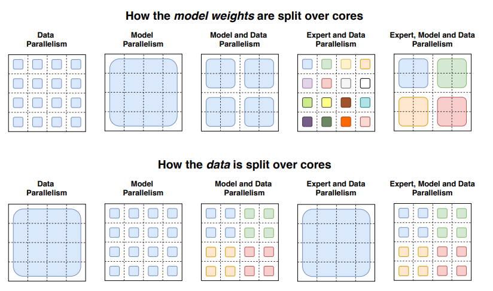
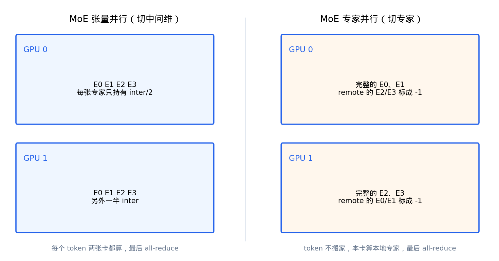
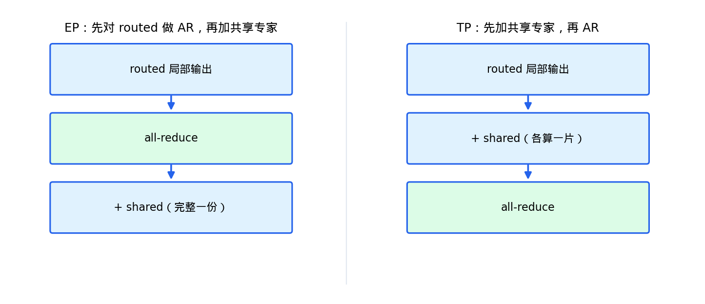

# 专家并行：切中间维还是切专家

融合核解决一张卡上怎么算。专家多时一张卡装不下，或想把专家摊到多张卡上减显存。这篇写 MoE 的两种切法，以及 v5 实际怎么做。

- [1] 稀疏与显存
- [2] MoE 张量并行
- [3] MoE 专家并行
- [4] v5：token 留在本地
- [5] 和 Attention TP 叠在一起
- [6] 共享专家与 all-reduce 顺序
- [7] 常考题

## 1. 稀疏与显存

稀疏只少算，不少存。Mixtral 8×7B 每次激活大约 13B，权重仍按约 47B 准备。Qwen1.5-MoE-A2.7B 激活 2.7B，总参数约 14B。Qwen3-30B-A3B 激活约 3B，总参数约 30B。

多卡第一动机常常是显存。切法有两种，切的对象不同。

## 2. MoE 张量并行

把单个专家当成普通 SwiGLU 来切。gate/up 沿中间维列并行，down 行并行。每张卡持有全部专家的一片：

- `w13` 中间维：`2 * moe_intermediate / tp`
- `w2` 输入维：`moe_intermediate / tp`

每个 token 在每张卡上都算局部结果，最后 all-reduce。通信量是一份 `[T, H]`，与稠密 MLP 的 TP 相同。每张卡仍存全部专家的分片，专家个数没有被除。

约束：`moe_intermediate_size` 能整除 `tp_size`。有共享专家时，共享中间维也要能整除。

## 3. MoE 专家并行

按专家编号分段。tp=2、8 个专家时：卡 0 拿专家 0–3 的完整权重，卡 1 拿专家 4–7。单个专家的中间维不再切，MoE 自己的 `tp_size` 变成 1。

显存按专家个数除。通信可以是 all-reduce，也可以是 all-to-all 把 token 送到专家所在卡。

Switch 论文 Figure 9 把数据并行、模型并行、专家并行画在同一组格子里。第四列是按专家切开；第五列是专家并行再叠模型并行（一个专家自己再切一刀）。



v5 做第四列那种。`enable_ep` 把 MoE 的 tp 设为 1，ep 等于原来的 tp。



## 4. v5：token 留在本地

GShard / Switch 常见写法：gate 本地打分，all-to-all 把 token 发到持有该专家的设备，算完再 all-to-all 送回。官方 vLLM 的 DeepEP / PPLX 走这条路。

v5 不搬 token。每张卡仍拿完整 `[T, H]`，用 `expert_map` 翻译全局专家号：

```
map[global_id] = local_id   # 本卡持有
map[global_id] = -1         # 在别人卡上
```

融合核看见 `-1` 就跳过。卡 0 只算落在本地专家上的那些路，卡 1 同理。同一个 token 的 top-2 若分属两张卡，各贡献一路，all-reduce 后得到完整结果；若两路都在同一张卡，另一张卡对应行是 0，加完仍对。

`tests/gpu/test_moe_kernel.py` 里 `test_expert_map_split_sum_matches_full` 验的就是：按 ep 切开分别算再相加，等于单卡全专家一次算完。

代价：每张卡都读完整 hidden；路由不均时某张卡可能几乎空转。

收益：

- 不新建 NCCL 组。`--ep` 只改 MoE 切法，`world_size` 仍是 `tp_size * pp_size`。
- 通信原语与稠密 TP 相同，都是 hidden 上的 all-reduce。
- fused 核不用管跨卡 dispatch，cutlass 里 `ep_size=1`。

`get_ep_group()` 开了 `--ep` 时返回 TP 组；没开时返回 size=1 的占位组。`set_expert_parallel` 翻一个布尔，不 `new_group`。

## 5. 和 Attention TP 叠在一起

`--tp 2 --ep` 不会把 world 变成两倍：

```
dp_size   → 独立 Engine 副本（不进 NCCL world）
tp_size   → 同 Engine 内张量并行
pp_size   → 同 Engine 内流水线
enable_ep → 不增加 world；Attention 仍走 TP，MoE 在同一批 TP rank 上按专家切
```

开 EP 之后：

| 模块 | 怎么切 |
| --- | --- |
| Attention / 词表 / 稠密 MLP | 仍按 `tp_size` 张量并行 |
| MoE gate | 每卡一份完整的 |
| MoE 专家权重 | 按 `ep_size = 原 tp_size` 切开，单个专家完整 |
| 共享专家 | 每卡一份完整的 |

`MoEParallelConfig.from_engine`：`enable_ep and tp_size > 1` 时返回 `tp_size=1, ep_size=旧 tp, ep_rank=旧 tp_rank`。

`EngineConfig._validate_parallel`：开 EP 要求 `num_experts % tp_size == 0`；不开 EP 要求 `moe_intermediate_size % tp_size == 0`。

## 6. 共享专家与 all-reduce 顺序

Qwen1.5-MoE / Qwen2-MoE 每个 token 必走共享专家：带 sigmoid 门的 SwiGLU，不经 top-k。顺序写反，共享贡献会被加 `ep` 次。



**EP。** 共享专家构造时 `tp_size=1`，每卡一份完整。routed 局部输出先 all-reduce，再加共享。若先加再 AR，共享项被求和 `ep` 次。

**TP。** 共享专家按中间维切开。routed 与 shared 都是部分和，先加再 AR，一次通信收齐。

Qwen3-MoE `shared_expert_intermediate_size=0`，共享支路不建。代码保留是为了 Qwen1.5 / Qwen2。

## 7. 常考题

**Q：MoE TP 和 EP 切的是什么？**  
TP 切单个专家的中间维，每卡仍有全部专家的分片。EP 切专家编号，每卡只有一部分专家的完整权重。

**Q：稀疏为什么还要多卡？**  
权重仍按总参数占显存。激活 3B 的模型总参数可以是 30B。

**Q：v5 的 EP 和 DeepEP 差在哪？**  
DeepEP 用 all-to-all 搬 token。v5 用 `expert_map` 把 remote 标成 `-1`，出口 all-reduce，token 不搬家。

**Q：为什么 EP 下共享专家必须 AR 之后再加？**  
共享在每卡都是完整一份。先加再 AR 会把同一项加 `ep` 次。

**Q：`--ep` 会不会增大 world_size？**  
不会。Attention 仍用原来的 TP 组；MoE 在同一组 rank 上改切法。

**Q：什么时候更倾向 EP？**  
专家多、单个中间维窄（如 Qwen3 128 选 8）时，EP 减显存更直接。专家少、中间维大（如 Mixtral 8 个较宽专家）时，TP 切 inter 更自然。

**Q：正确性怎么验？**  
`tests/distributed/test_moe_parallel.py`：同一 prompt，`tp=1` / `tp=2` / `tp=2+ep` 的 greedy 序列一致。延迟用 `bench/moe_e2e.py`，这里不写具体 tok/s。

下一篇按文件写权重形状、加载、后端，以及和官方实现的差异。
